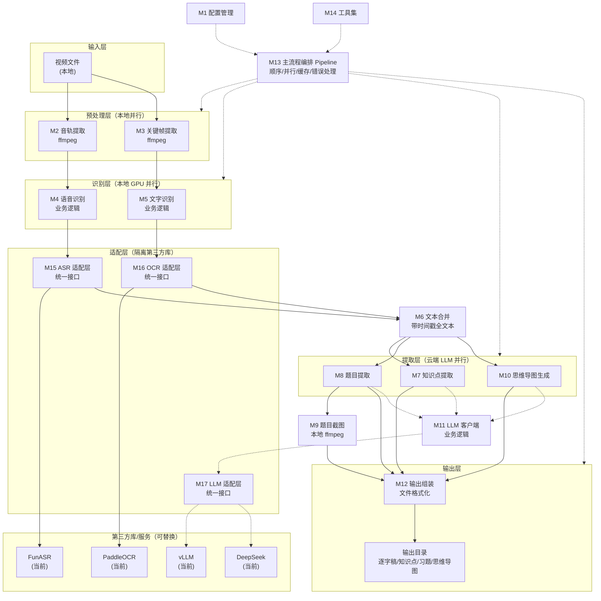
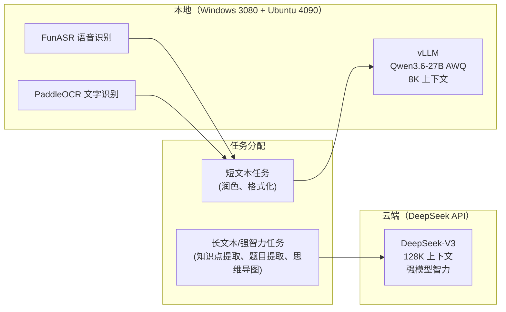

# 架构设计文档

> 版本：v1.0
> 日期：2026-08-23
> 状态：待确认
> 前置文档：01_需求分析.md

---

## 一、架构概述

### 1.1 架构定位

本架构设计定义系统的模块划分、各模块的功能职责、模块间的数据流向（分流点与汇聚点），以及设计决策的理由。**不涉及具体接口参数和实现细节**（接口设计见 `03_接口设计/`，详细设计见 `04_详细设计/`）。

### 1.2 架构总览

系统采用**流水线 + 并行分支**架构：
- 视频输入后分为音轨提取和关键帧提取两条并行分支
- 识别完成后合并为带时间戳的全文本
- 全文本分为知识点提取、题目提取、思维导图生成三条并行分支
- 最终汇聚到输出组装模块，生成所有输出文件

---

## 二、设计原则

| 原则 | 说明 |
|---|---|
| **单一职责** | 每个模块只负责一件事，便于独立开发、测试、替换 |
| **并行优先** | 无依赖的模块并行执行，减少总处理时间 |
| **LLM 集中管理** | 所有大模型调用统一走 LLM 客户端模块，支持双后端切换 |
| **云端处理长文本** | 知识点提取、题目提取、思维导图生成都需要全局视角和长上下文，统一用云端 DeepSeek |
| **本地处理短文本** | 音视频处理、识别、截图等计算密集型任务在本地完成 |
| **可替换性** | 各模块通过明确的数据接口交互，可独立替换实现（如换 ASR 引擎、换 OCR 引擎） |
| **质量优先** | MVP 阶段不追求极致速度，优先保证输出质量 |

---

## 三、模块划分

### 3.1 模块清单

| 编号 | 模块名称 | 功能职责 | 部署位置 |
|---|---|---|---|
| M1 | 配置管理模块 | 加载/校验配置，集中管理所有参数 | 本地（Windows 3080） |
| M2 | 音轨提取模块 | 从视频中提取音轨，转换为 ASR 要求的格式 | 本地 |
| M3 | 关键帧提取模块 | 从视频中按间隔提取关键帧图片 | 本地 |
| M4 | 语音识别模块 | 语音识别业务逻辑（批量处理、缓存、时间戳管理），通过适配层调用具体 ASR 引擎 | 本地（GPU） |
| M5 | 文字识别模块 | 文字识别业务逻辑（帧去重、缓存、时间戳管理），通过适配层调用具体 OCR 引擎 | 本地（GPU） |
| M6 | 文本合并模块 | 合并 ASR 和 OCR 结果，生成带时间戳的全文本 | 本地 |
| M7 | 知识点提取模块 | 基于全文本，识别视频中的知识点并标注时间戳 | 云端（DeepSeek） |
| M8 | 题目提取模块 | 基于全文本，识别所有题目，提取原题和解题步骤 | 云端（DeepSeek） |
| M9 | 题目截图模块 | 根据题目提取结果，在视频中截取题目画面 | 本地 |
| M10 | 思维导图生成模块 | 基于全文本和知识点，生成课程知识结构 | 云端（DeepSeek） |
| M11 | LLM 客户端模块 | LLM 调用业务逻辑（双后端管理、重试、缓存、流式），通过适配层调用具体 LLM 服务 | 本地 |
| M12 | 输出组装模块 | 将各模块结果格式化为输出文件，按规范目录组织 | 本地 |
| M13 | 主流程编排模块（Pipeline） | 串联所有模块，管理执行顺序、并行控制、断点续传、错误处理 | 本地 |
| M14 | 工具集 | token 计数、时间戳格式化、视频信息探测、日志 | 本地 |
| **M15** | **语音识别适配层** | **定义统一 ASR 接口，封装具体 ASR 引擎（当前 FunASR），隔离第三方库变化** | 本地 |
| **M16** | **文字识别适配层** | **定义统一 OCR 接口，封装具体 OCR 引擎（当前 PaddleOCR），隔离第三方库变化** | 本地 |
| **M17** | **LLM 适配层** | **定义统一 LLM 接口，封装具体 LLM 服务（当前 vLLM + DeepSeek），隔离第三方库变化** | 本地 |

### 3.2 模块功能详细说明

#### M1 配置管理模块
- 加载 YAML 配置文件
- 校验配置参数合法性
- 提供统一的配置访问接口
- 管理敏感信息（API Key 从环境变量读取，不硬编码）

#### M2 音轨提取模块
- 调用 ffmpeg 从视频中提取音轨
- 转换为 FunASR 要求的格式（16kHz，单声道，WAV）
- 输出：WAV 音频文件
- 缓存到本地，支持断点续传

#### M3 关键帧提取模块
- 调用 ffmpeg 按固定间隔（默认 30 秒）提取关键帧
- 输出：JPG/PNG 图片列表，每张带时间戳
- 缓存到本地，支持断点续传

#### M4 语音识别模块
- 语音识别业务逻辑：批量处理、缓存管理、时间戳管理
- 通过 M15 语音识别适配层调用具体 ASR 引擎
- 不直接依赖 FunASR 的 API
- 输出：带起止时间戳的句子列表
- 缓存到本地，支持断点续传

#### M5 文字识别模块
- 文字识别业务逻辑：帧去重、缓存管理、时间戳管理
- 通过 M16 文字识别适配层调用具体 OCR 引擎
- 不直接依赖 PaddleOCR 的 API
- 输出：带帧时间戳的识别文字列表
- 缓存到本地，支持断点续传

#### M6 文本合并模块
- 合并 ASR 结果（语音文字）和 OCR 结果（课件文字）
- 按时间戳排序
- 输出：带时间戳的全文本（用于 LLM 处理）
- 区分来源标记（asr / ocr）

#### M7 知识点提取模块
- 调用 LLM（云端 DeepSeek），基于全文本识别视频中的知识点
- 为每个知识点标注起始时间戳
- 输出：知识点列表（名称 + 时间戳）
- 约束：极简，不做过度解读，不标注重点难点

#### M8 题目提取模块
- 调用 LLM（云端 DeepSeek），基于全文本识别视频中老师讲解的所有题目
- 提取每道题的：开始时间、结束时间、原题文字、解题步骤
- 标注题目是否含图
- 输出：结构化题目列表（JSON 格式，便于程序解析）
- 采用全文一次性语义判断，不硬编码关键词

#### M9 题目截图模块
- 根据题目提取结果中的开始时间
- 在视频中该时间点 ±5秒 范围内选取最佳帧
- 裁剪题目区域（排除老师人像等无关区域）
- 输出：题目截图图片文件
- 命名规范：`题目XX.png`

#### M10 思维导图生成模块
- 调用 LLM（云端 DeepSeek），基于全文本和知识点列表生成课程知识结构
- 输出：OPML 格式的思维导图数据
- 根节点为课程主题，子节点为章节/知识点

#### M11 LLM 客户端模块
- LLM 调用业务逻辑：双后端管理、重试机制、结果缓存、流式响应处理
- 通过 M17 LLM 适配层调用具体 LLM 服务
- 不直接依赖 vLLM 或 DeepSeek 的 API
- 后端选择策略：
  - 知识点提取、题目提取、思维导图生成 → 云端（长文本/强智力）
  - 其他短文本任务 → 本地（免费）

#### M12 输出组装模块
- 将各模块结果格式化为输出文件
- 按规范目录结构组织输出
- 生成文件：
  - `01_逐字稿.md`（基于 ASR 结果）
  - `02_知识点清单.md`（基于知识点提取结果）
  - `03_思维导图.opml`（基于思维导图生成结果）
  - `习题/题目XX_原题.md`（基于题目提取 + 截图）
  - `习题/题目XX_解析.md`（基于题目提取）
  - `截图/题目XX.png`（基于题目截图）

#### M13 主流程编排模块（Pipeline）
- 串联所有模块，管理执行顺序
- 控制并行分支（音轨/关键帧并行，知识点/题目/思维导图并行）
- 管理断点续传（检查缓存，跳过已完成步骤）
- 错误处理（重试、降级、中断）
- 日志记录
- 进度跟踪

#### M14 工具集
- token 计数（tiktoken 封装）
- 时间戳格式化（秒 ↔ mm:ss / hh:mm:ss）
- 视频信息探测（ffprobe 封装：时长、分辨率、帧率、音轨编码）
- 日志配置
- 文件操作工具

#### M15 语音识别适配层（ASR Adapter）
- **设计模式**：适配器模式（Adapter Pattern）
- **职责**：定义统一的 ASR 调用接口，封装具体 ASR 引擎的 API 差异
- **统一接口定义**：
  - `transcribe(audio_path) -> List[Sentence]`：语音识别，返回带时间戳的句子列表
  - `load_model(config)`：加载模型
  - `unload_model()`：卸载模型，释放显存
- **当前实现**：FunASRAdapter（封装 paraformer-zh + ct-punc + fsmn-vad）
- **可扩展实现**：WhisperAdapter、SenseVoiceAdapter 等（将来更换引擎时新增）
- **隔离效果**：M4 语音识别模块只依赖统一接口，不依赖 FunASR；更换引擎时只需新增适配器，M4 代码零修改
- **数据结构**：Sentence（start_time, end_time, text, confidence）

#### M16 文字识别适配层（OCR Adapter）
- **设计模式**：适配器模式（Adapter Pattern）
- **职责**：定义统一的 OCR 调用接口，封装具体 OCR 引擎的 API 差异
- **统一接口定义**：
  - `recognize(image_path) -> List[OCRResult]`：文字识别，返回识别结果列表
  - `load_model(config)`：加载模型
  - `unload_model()`：卸载模型，释放显存
- **当前实现**：PaddleOCRAdapter（封装 PaddleOCR 检测+识别模型）
- **可扩展实现**：EasyOCRAdapter、TesseractAdapter、MMOCRAdapter 等
- **隔离效果**：M5 文字识别模块只依赖统一接口，不依赖 PaddleOCR；更换引擎时只需新增适配器
- **数据结构**：OCRResult（text, confidence, bounding_box）

#### M17 LLM 适配层（LLM Adapter）
- **设计模式**：适配器模式（Adapter Pattern）
- **职责**：定义统一的 LLM 调用接口，封装具体 LLM 服务的 API 差异
- **统一接口定义**：
  - `chat(messages, **kwargs) -> LLMResponse`：非流式对话
  - `chat_stream(messages, **kwargs) -> Iterator[LLMChunk]`：流式对话
  - `get_context_length() -> int`：获取模型上下文长度
  - `count_tokens(text) -> int`：统计 token 数
- **当前实现**：
  - VLLMAdapter（封装本地 vLLM OpenAI 兼容 API）
  - DeepSeekAdapter（封装云端 DeepSeek API）
- **可扩展实现**：OpenAIAdapter、ClaudeAdapter、QwenCloudAdapter 等
- **隔离效果**：M11 LLM 客户端模块只依赖统一接口，不依赖具体 LLM 服务；更换或新增 LLM 服务时只需新增适配器
- **数据结构**：LLMResponse（content, usage, model）、LLMChunk（delta_content, usage）

---

## 四、数据流向

### 4.1 整体数据流

```
视频文件
   │
   ├───────────────────────┐
   ▼                       ▼
[M2 音轨提取]         [M3 关键帧提取]
   │                       │
   ▼                       ▼
[M4 语音识别]         [M5 文字识别]
   │                       │
   └───────────┬───────────┘
               ▼
         [M6 文本合并]
               │
   ┌───────────┼───────────┐
   ▼           ▼           ▼
[M7 知识点] [M8 题目提取] [M10 思维导图]
   │           │               │
   │           ▼               │
   │      [M9 题目截图]        │
   │           │               │
   └───────────┼───────────────┘
               ▼
         [M12 输出组装]
               │
               ▼
         输出文件目录
```

### 4.2 分流点与汇聚点

#### 分流点 1：视频输入 → 音轨提取 + 关键帧提取
- **位置**：视频输入后
- **分流原因**：音轨提取和关键帧提取互不依赖，可并行执行
- **输出**：WAV 音频文件 + 关键帧图片列表

#### 汇聚点 1：ASR 结果 + OCR 结果 → 文本合并
- **位置**：语音识别和文字识别完成后
- **汇聚原因**：两个识别结果都需要按时间戳合并，生成全文本供 LLM 处理
- **输出**：带时间戳的全文本（含来源标记 asr/ocr）

#### 分流点 2：全文本 → 知识点提取 + 题目提取 + 思维导图生成
- **位置**：文本合并完成后
- **分流原因**：三个提取任务都基于全文本，互不依赖，可并行执行
- **输出**：知识点列表 + 题目列表 + 思维导图数据

#### 汇聚点 2：题目提取结果 + 题目截图 → 习题文件
- **位置**：题目提取和题目截图完成后
- **汇聚原因**：原题文件需要同时包含题目文字和截图引用
- **输出**：题目XX_原题.md + 题目XX_解析.md

#### 汇聚点 3：所有输出 → 输出组装
- **位置**：所有提取任务完成后
- **汇聚原因**：统一格式化所有输出文件，按规范目录组织
- **输出**：完整的输出目录

### 4.3 LLM 调用流向

```
[M7 知识点提取] ──┐
[M8 题目提取]  ───┼──▶ [M11 LLM 客户端] ──┬──▶ 本地 vLLM（短文本任务）
[M10 思维导图]  ──┘                          └──▶ 云端 DeepSeek（长文本/强智力）
```

- M7、M8、M10 都通过 M11 LLM 客户端调用大模型
- M11 根据任务类型自动选择后端
- 三个任务都用云端 DeepSeek（长文本/强智力）

---

## 五、架构图

### 5.1 模块架构图



### 5.2 双后端架构图



---

## 六、设计理由

### 6.1 为什么用流水线 + 并行分支架构

| 决策 | 理由 |
|---|---|
| 音轨和关键帧并行提取 | 两个任务互不依赖，ffmpeg 可同时处理，减少预处理时间 |
| ASR 和 OCR 并行识别 | 两个识别任务互不依赖，GPU 可分时复用，减少识别时间 |
| 知识点/题目/思维导图并行提取 | 三个任务都基于全文本，互不依赖，可同时调用云端 LLM |
| 文本合并作为汇聚点 | ASR 和 OCR 结果需要按时间戳合并后才能供 LLM 处理 |
| 输出组装作为最终汇聚点 | 所有输出需要统一格式化和目录组织 |

### 6.2 为什么 LLM 调用集中管理

- **统一接口**：各模块不需要关心后端差异，只需调用统一接口
- **灵活切换**：后端选择策略可在配置中调整，不需要改各模块代码
- **重试/缓存统一**：重试机制和结果缓存集中在 LLM 客户端，避免重复实现
- **成本控制**：集中管理便于统计 token 消耗和成本

### 6.3 为什么知识点/题目/思维导图都用云端

| 任务 | 本地 8K 是否够用 | 为什么用云端 |
|---|---|---|
| 知识点提取 | 不够（全文本可能 2-5 万 token） | 128K 上下文可一次性处理全文，全局视角不遗漏 |
| 题目提取 | 不够（全文本可能 2-5 万 token） | 128K 上下文可一次性识别所有题目，不会漏题 |
| 思维导图生成 | 不够（需要全文 + 知识点列表） | 强模型智力更适合生成结构化知识图谱 |

### 6.4 为什么题目提取用 LLM 语义判断而非关键词匹配

- **老师表达方式多样**："这道题""我们来看""去年考了""有意思的题"等，关键词匹配无法覆盖
- **LLM 理解语义**：能判断"老师接下来是不是要讲题"，不依赖预设关键词
- **全局视角**：LLM 看完全文，能区分题目和知识点/定义/定理，减少误判
- **直接结构化输出**：LLM 可一次性输出题目列表（含原题、解析、时间戳），后续只需格式化

### 6.5 为什么题目截图作为参考附件而非主输出

- **OCR 和 LLM 提取不可能 100% 准确**：公式、图形、复杂排版可能出错
- **截图作为兜底**：学生发现提取不准确时可对照截图
- **不追求截图完美**：只在题目开始点附近截取，作为参考而非最终输出
- **后期可优化**：多模态模型能力提升后，可减少对截图的依赖

### 6.6 为什么为语音识别/文字识别/LLM 增加适配层

- **第三方库效果不确定**：现阶段选型的 FunASR、PaddleOCR、vLLM 实际效果未经验证，将来可能需要更换
- **隔离变化**：适配层（Adapter Pattern）将核心业务代码与第三方库 API 隔离，更换引擎时只需新增适配器，核心代码零修改
- **统一接口**：定义统一的调用接口（如 `transcribe()`、`recognize()`、`chat()`），核心模块只依赖接口，不依赖具体实现
- **可扩展性**：将来新增引擎（如 Whisper、EasyOCR、Claude）时，只需实现适配器接口，无需修改核心逻辑
- **测试友好**：可编写 Mock 适配器用于单元测试，不依赖真实第三方库
- **三个适配层**：
  - M15 ASR 适配层：隔离 FunASR（当前），可扩展 Whisper、SenseVoice 等
  - M16 OCR 适配层：隔离 PaddleOCR（当前），可扩展 EasyOCR、MMOCR 等
  - M17 LLM 适配层：隔离 vLLM + DeepSeek（当前），可扩展 OpenAI、Claude、通义千问等

---

## 七、需求满足映射

### 7.1 痛点满足映射

| 痛点 | 对应模块 | 满足方式 |
|---|---|---|
| P1 老师语速快，手动记笔记慢 | M4 语音识别 + M12 输出组装 | 自动生成逐字稿，学生无需手动记 |
| P2 视频太长，复习找不到重点 | M7 知识点提取 + M12 输出组装 | 知识点清单带起始时间戳，10秒内定位 |
| P3 手动抄题耗时 | M8 题目提取 + M9 题目截图 + M12 输出组装 | 自动提取原题和解析，截图保留题目画面 |
| P4 公式/结构图抄录麻烦 | M5 文字识别 + M9 题目截图 + M12 输出组装 | OCR 提取文字，截图保留公式和图形 |
| P5 题目带图，手动画图麻烦 | M9 题目截图 | 直接截取题目画面，无需手动画 |

### 7.2 输出物满足映射

| 输出物 | 对应模块 | 生成方式 |
|---|---|---|
| O1 逐字稿 | M4 语音识别 → M12 输出组装 | ASR 结果格式化为 Markdown |
| O2 知识点清单 | M7 知识点提取 → M12 输出组装 | LLM 识别知识点 + 时间戳，格式化为 Markdown |
| O3 习题整理 | M8 题目提取 + M9 题目截图 → M12 输出组装 | LLM 提取原题+解析，截图截取题目画面，生成两个文件 |
| O4 思维导图 | M10 思维导图生成 → M12 输出组装 | LLM 生成知识结构，输出 OPML 格式 |
| O5 题目截图 | M9 题目截图 | ffmpeg 在题目开始点附近截帧 |

### 7.3 功能需求满足映射

| 功能需求 | 对应模块 |
|---|---|
| F1.1 语音转文字 | M2 音轨提取 + M4 语音识别 |
| F1.2 课件文字提取 | M3 关键帧提取 + M5 文字识别 |
| F1.3 关键帧截图 | M3 关键帧提取 + M9 题目截图 |
| F2.1-F2.3 知识点提取 | M7 知识点提取 + M6 文本合并 |
| F3.1-F3.5 习题提取 | M8 题目提取 + M9 题目截图 |
| F4.1-F4.2 思维导图生成 | M10 思维导图生成 |
| F5.1 目录结构 | M12 输出组装 |
| F5.2 断点续传 | M13 主流程编排 + 各模块缓存 |
| F5.3 错误处理 | M13 主流程编排 + M11 LLM 客户端 |

---

## 八、架构约束与风险

### 8.1 架构约束

| 约束 | 说明 |
|---|---|
| 硬件约束 | 本地 GPU：RTX 3080 10GB（识别）+ RTX 4090 24GB（推理） |
| 上下文约束 | 本地模型 8K，云端模型 128K |
| 成本约束 | 云端 API 单次处理成本 < ¥0.5 |
| 格式约束 | 输出 Markdown、OPML、PNG 通用格式 |

### 8.2 架构风险

| 风险 | 影响 | 缓解措施 |
|---|---|---|
| 云端 API 不可用 | 知识点/题目/思维导图无法生成 | 降级到本地模型（分段处理），或缓存结果支持离线重跑 |
| LLM 题目识别漏题 | 习题不完整 | Prompt 强调不遗漏，输出题目数量，人工可核对 |
| LLM 知识点误判 | 知识点清单不准确 | 极简输出，学生可根据时间戳回看验证 |
| 题目截图截错位置 | 截图不包含题目主体 | ±5秒范围选最佳帧，裁剪题目区域 |
| ASR/OCR 准确率不足 | 全文本质量差，影响 LLM 提取 | 使用高精度模型，缓存中间结果便于调试 |

---

*文档结束*
