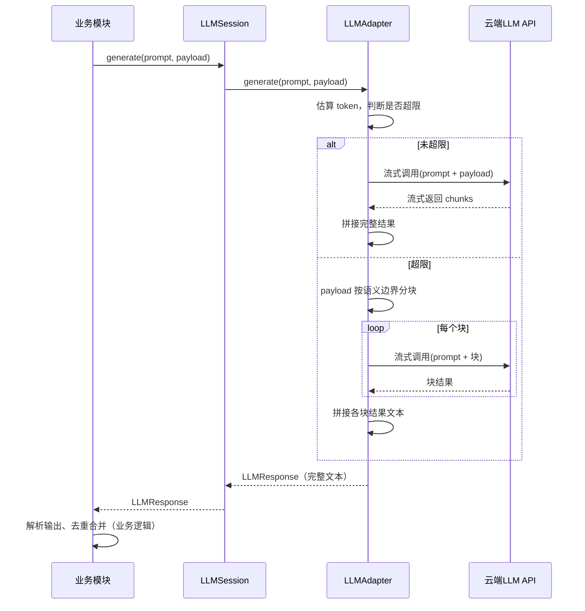

# LLM 接口重构设计

> 状态：设计已确认，待编码实现
> 对应 Issue：#4 [C-003] 硬编码配置值未从配置文件读取
> 创建时间：2026-08-26
> 最后更新：2026-08-26

---

## 一、背景与目标

当前 `LLMAdapter` 接口将 temperature、top_p、max_tokens、stream 等模型参数直接暴露给上层业务模块，导致：

1. **违反 LoD**：上层业务模块需要知道 LLM 底层参数语义和上下文限制
2. **违反 DIP**：高层模块依赖低层模型参数，换模型所有调用点都要改
3. **硬编码**：各业务模块硬编码 temperature=0.1、max_tokens=8000 等
4. **模型名校验缺失**：config.yaml 中模型名为自由字符串，写错只能运行时发现

**目标**：重新定义 LLM 层接口，上层只表达"做什么任务"，模型参数和限制由 LLM 层内部管理。

---

## 二、技术选型

> 决策时间：2026-08-26
> 依据：R-005 LLM 应用框架选型调研

**选定方案 A：LiteLLM + 自实现分块 + 标准库解析。**

| 需求 | 方案 | 说明 |
|---|---|---|
| D1 多模型统一调用 | **LiteLLM** | `completion(model="openai/xxx", api_base=...)` 统一 OpenAI 格式调用豆包/DeepSeek；内置异常映射（400/401/429/5xx 分类） |
| D2 长文本分块 | **自实现** | 参考 R-004 递归分隔符策略（`\n\n`→`\n`→`。！？`→空格→强制切分），基于 token 估算 chunk_size，不用 chunk_overlap |
| D3 生产级调用 | **LiteLLM 内置 + 自实现流式拼接** | LiteLLM 提供 num_retries 重试、timeout、stream=True、Router fallback；流式 chunk 拼接由 LLM 层内部完成 |
| D4 输出解析 | **Python 标准库** | `json` 解析 JSON，`xml.etree.ElementTree` 解析 OPML/XML，纯文本直接使用 |
| D5 轻量 | **只加 litellm 一个依赖** | 不引入 LangChain/Pydantic AI 等重型框架 |

**不引入 LangChain 的原因**：Map-Reduce chain 的 reduce 是再调 LLM 做摘要，和我们的代码拼接模式不匹配；依赖重、版本迭代快；我们只需要分块逻辑，参考其设计自行实现即可。

---

## 三、功能边界

### LLM 层职责

LLM 是一个**文本生成服务**：接收提示词（prompt）和待处理内容（payload），返回完整文本结果。

| 职责 | 说明 |
|---|---|
| 模型调用 | 发送提示词+内容、接收响应 |
| 模型参数管理 | temperature、top_p、max_tokens 等由 LLM 层根据模型配置内部设定 |
| 上下文超限处理 | payload 超限时按语义边界分块，逐块调用，拼接结果文本返回（R-003 已确认） |
| 重试与超时 | 限流退避、服务端错误重试、超时处理 |
| 流式接收 | 内部统一走流式接收，拼接完整结果后返回上层（防超时） |
| 错误分类 | 参数错误不重试、认证失败不重试、限流退避、服务端错误重试 |
| 模型注册表管理 | 管理可用模型列表、能力、上下文长度等 |

### 业务模块职责

| 职责 | 说明 |
|---|---|
| 提示词构建 | 设计 prompt（指令），每个任务完全不同；分块场景下 prompt 需保证每块输出格式可拼接 |
| 内容准备 | 准备 payload（待处理的文本） |
| 输出解析 | JSON / OPML / 纯文本解析 |
| 业务后处理 | 时间戳对齐、去重合并、对象转换等 |

### 当前 LLM 使用场景

| 任务 | 业务模块 | 输入 | 输出格式 | temperature |
|---|---|---|---|---|
| 纠错+知识点+题目提取 | `core/knowledge_extractor.py` + `core/problem_extractor.py` | ASR 全文 | JSON（纠错全文+知识点段+题目段） | 0.1 |
| 知识点深度整理 | `core/knowledge_extractor.py` | ASR 段+OCR 文字 | Markdown（LaTeX 公式嵌入） | 0.3 |
| 题目原题提取 | `core/problem_extractor.py` | 题目时间段+OCR+截图 | Markdown（题目原文+截图） | 0.0 |
| 解题过程整理 | `core/problem_extractor.py` | 题目时间段+ASR+OCR | Markdown（解题步骤+时间戳） | 0.2 |
| 思维导图生成 | `core/mindmap_generator.py` | 知识点列表 | OPML | 0.3 |

---

## 四、参数归属结论

以下结论已逐点讨论确认：

| 参数 | 归属 | 理由 |
|---|---|---|
| temperature | LLM 层 | 控制随机性的模型参数。不同任务需要不同随机性是当前大模型能力的局限性，"任务需要确定性输出"是意图，用什么参数实现是模型细节。且不是所有模型都支持 |
| top_p | LLM 层 | 同上，核采样机制，不是所有模型都支持 |
| max_tokens | LLM 层 | 作用是成本保护和上下文限制，都是 LLM 层自己的事。上层没有"输出长度需求"，输出长度是生成结果不是任务需求 |
| stream | LLM 层 | 设计初衷是实时消费输出（聊天逐字显示、提前终止），本项目是批处理无此需求。LLM 层内部统一流式接收防超时，拼接完整结果返回 |
| thinking/reasoning | LLM 层 | 不同模型实现方式不同（豆包 thinking.type、OpenAI reasoning_effort、DeepSeek 模型名区分），是 API 实现细节 |
| presence_penalty | LLM 层 | 当前项目用不到，默认 0 |
| frequency_penalty | LLM 层 | 同上 |
| stop | LLM 层 | 当前项目用不到，模型自然结束生成 |
| model/provider | 配置指定 | 通过任务-模型映射配置选择，模型注册表校验，不硬编码在代码中 |

---

## 五、模型注册表设计

### 设计原则

**稳定的放代码，易变的放配置：**

- **代码**：能力类型枚举、配置校验逻辑、LLM 层逻辑（依赖能力抽象，不依赖具体模型名）
- **配置**：模型列表、任务-模型映射、provider 连接信息

模型更新时只改 yaml 配置，不改代码。除非出现全新的能力类型（如视频理解），才需要改代码加枚举。

### 能力类型枚举（代码中定义）

```python
class ModelCapability(Enum):
    TEXT = "text"            # 文本生成
    VISION = "vision"        # 图片理解（多模态）
    REASONING = "reasoning"  # 深度思考
```

### 模型注册表（config.yaml）

每个模型声明：名称、provider、能力标签、上下文长度、最大输出长度。

```yaml
llm:
  models:
    - name: doubao-seed-2-1-pro-260628
      provider: volcengine
      capabilities: [TEXT, REASONING]
      context_length: 256000
      max_output: 16384

    - name: doubao-seed-2-0-lite-xxxx
      provider: volcengine
      capabilities: [TEXT]
      context_length: 128000
      max_output: 8192

    - name: deepseek-chat
      provider: deepseek
      capabilities: [TEXT, REASONING]
      context_length: 128000
      max_output: 8192
```

### 任务-模型映射（config.yaml）

任务映射是应用层配置，不属于 llm 节，由 pipeline 层读取。每个任务可独立指定模型和 temperature：

```yaml
# 应用层配置：任务→模型映射
tasks:
  # 纠错+知识点+题目提取（一次调用返回三样东西）
  asr_correction:
    model: doubao-seed-2-1-pro-260628
    temperature: 0.1
  # 知识点深度整理（口语→书面语、公式LaTeX、高考补充）
  knowledge_summary:
    model: doubao-seed-2-1-pro-260628
    temperature: 0.3
  # 题目原题提取（OCR印刷体，纯提取）
  problem_extraction:
    model: doubao-seed-2-1-pro-260628
    temperature: 0.0
  # 解题过程整理（ASR+OCR组织成连贯步骤）
  solution_summary:
    model: doubao-seed-2-1-pro-260628
    temperature: 0.2
  # 思维导图生成（归纳层级结构）
  mindmap_generation:
    model: doubao-seed-2-0-lite-xxxx
    temperature: 0.3
```

**temperature 默认值分析：**

| 场景 | temperature | 理由 |
|---|---|---|
| 纠错+知识点+题目提取 | 0.1 | 纠错要修正 ASR 同音词/断句但不能改原意，知识点和题目边界识别要准确，几乎不需要创造性。0.1 留一点点弹性处理同音词选择 |
| 知识点深度整理 | 0.3 | 需要把口语化讲解组织成书面语、公式转 LaTeX、补充高考范围内的相关内容，需要适度语言组织能力，但不能脱离老师讲的内容 |
| 题目原题提取 | 0.0 | 纯提取任务，OCR 识别什么就输出什么，越确定越好。题目文字不允许任何发挥 |
| 解题过程整理 | 0.2 | 需要把零散的语音和板书文字组织成连贯步骤，但内容必须忠实于老师讲解，只需要最低限度的语言组织灵活性 |
| 思维导图生成 | 0.3 | 需要归纳层级结构、提炼节点名称，有一定的组织创造性，但内容必须来自视频，不能虚构 |

**核心原则**：提取/纠错类用 0-0.1，整理/组织类用 0.2-0.3。本项目所有场景都不需要高随机性，没有场景适合超过 0.5。temperature 在配置中按任务设定，业务代码不直接接触该参数。

### Provider 连接配置（config.yaml）

API key 直接写在 config.yaml 中。config.yaml 加入 `.gitignore` 不提交，另提供 `config.example.yaml` 模板（API key 留空）提交到 git：

```yaml
llm:
  providers:
    volcengine:
      base_url: https://ark.cn-beijing.volces.com/api/v3
      api_key:                    # 在 config.yaml 中填入，config.example.yaml 中留空
    deepseek:
      base_url: https://api.deepseek.com
      api_key:
```

> 配置文件管理：删除 `.env` / `.env.example` / python-dotenv 依赖，统一使用 config.yaml 一套配置系统。`git rm --cached config.yaml` 从 git 移除跟踪但保留本地文件。

### 启动时校验

**LLM 层校验**（配置加载时）：
1. 每个 model 的 provider 必须在 providers 列表中存在
2. capabilities 必须是 `ModelCapability` 枚举值
3. provider 必须有对应的适配器实现
4. provider 的 api_key 不能为空

**应用层校验**（pipeline 初始化时）：
1. 每个 task 引用的 model 必须在 LLM 模型注册表中存在

---

## 六、接口设计（草案）

### 分层原则

**LLM 层不知道任务，业务模块不知道模型，pipeline 层负责组装。**

- **LLM 层**：知道模型（注册表、能力、参数），不知道"知识点提取"、"ASR纠错"等业务概念
- **业务模块**：知道任务（构建提示词、解析输出），不知道模型名、模型参数
- **pipeline 层**：从配置读取"任务→模型"映射，创建会话，注入业务模块

### LLMAdapter 接口

适配器在初始化时绑定具体模型配置。调用时接收提示词和待处理内容，超限时内部分块处理。

**底层实现使用 LiteLLM**（`litellm.completion()`），适配器负责将模型配置转换为 LiteLLM 调用参数，并处理分块、流式拼接、错误分类：

```python
class LLMAdapter(ABC):
    @abstractmethod
    def __init__(self, model_config: ModelConfig, provider_config: ProviderConfig):
        """初始化时绑定模型和 provider 配置"""
        pass

    @abstractmethod
    def generate(self, prompt: str, payload: str) -> LLMResponse:
        """生成文本

        Args:
            prompt: 提示词（指令），超限时每块复用
            payload: 要处理的内容，超限时对其分块

        适配器内部负责：
        - 通过 LiteLLM completion() 调用模型
        - 设置 temperature/top_p 等模型参数（使用模型默认值）
        - 计算 max_tokens（根据 context_length 和输入长度）
        - 统一 stream=True 流式接收，拼接完整结果
        - 上下文超限时对 payload 递归分隔符分块，逐块调用，代码拼接结果文本
        - 利用 LiteLLM 异常映射做错误分类和重试
        """
        pass
```

### LLMClient 接口

LLMClient 只负责模型注册表管理和会话创建，不知道任务：

```python
class LLMClient:
    def get_session(self, model_name: str, temperature: float = 0.1) -> "LLMSession":
        """创建一个绑定到指定模型和 temperature 的会话

        Args:
            model_name: 模型注册表中的模型名
            temperature: 任务级随机性控制（由 pipeline 从任务配置传入）

        Returns:
            LLMSession 实例
        """
        pass

    def health_check(self) -> bool:
        """检查 LLM 服务是否可用（内部使用注册表中的模型）"""
        pass
```

### LLMSession 接口

会话绑定了具体模型，业务模块只依赖这个极简接口：

```python
class LLMSession:
    def generate(self, prompt: str, payload: str) -> LLMResponse:
        """使用绑定的模型生成文本

        Args:
            prompt: 提示词（指令）
            payload: 要处理的内容
        """
        pass
```

### 业务模块依赖的抽象

业务模块不依赖 LLMClient 或 LLMSession 具体类，只依赖一个 Protocol：

```python
from typing import Protocol

class LLMGenerator(Protocol):
    """业务模块依赖的极简抽象：给定提示词和内容，返回生成结果"""
    def generate(self, prompt: str, payload: str) -> LLMResponse:
        ...
```

### 业务模块调用方式

```python
class KnowledgeExtractor:
    def __init__(self, llm: LLMGenerator):
        self.llm = llm  # 不知道模型，不知道任务映射，只知道能 generate

    def extract(self, text: str) -> List[KnowledgePoint]:
        prompt = self._build_prompt()               # 业务模块构建提示词
        response = self.llm.generate(prompt, text)  # 传提示词和内容
        return self._parse_response(response.content)  # 业务模块解析和去重
```

### pipeline 层组装

```python
# pipeline 层从配置读取任务→模型映射，创建会话并注入
class Pipeline:
    def __init__(self, config):
        llm_client = LLMClient(config.llm)

        # 纠错+知识点+题目提取：pro 模型，temperature=0.1
        t = config.tasks["asr_correction"]
        session = llm_client.get_session(t.model, t.temperature)
        self.extractor = KnowledgeExtractor(session)

        # 知识点深度整理：pro 模型，temperature=0.3
        t = config.tasks["knowledge_summary"]
        session = llm_client.get_session(t.model, t.temperature)
        self.knowledge_summary = KnowledgeSummary(session)

        # 思维导图：lite 模型，temperature=0.3
        t = config.tasks["mindmap_generation"]
        session = llm_client.get_session(t.model, t.temperature)
        self.mindmap_generator = MindmapGenerator(session)
```

### 上下文超限处理流程



---

## 七、配置数据结构（config.py 草案）

模型注册表和 provider 配置属于 LLM 层；任务-模型映射属于应用层配置，由 pipeline 读取：

```python
class ModelCapability(Enum):
    TEXT = "text"
    VISION = "vision"
    REASONING = "reasoning"


@dataclass
class ModelConfig:
    """LLM 层：模型注册表条目"""
    name: str
    provider: str
    capabilities: List[ModelCapability]
    context_length: int
    max_output: int


@dataclass
class ProviderConfig:
    """LLM 层：provider 连接配置"""
    name: str
    base_url: str
    api_key: str  # 从 config.yaml 读取，不提交 git


@dataclass
class LLMConfig:
    """LLM 层配置：只包含模型和 provider，不包含任务"""
    models: Dict[str, ModelConfig]
    providers: Dict[str, ProviderConfig]
    max_retries: int = 3


@dataclass
class TaskConfig:
    """应用层配置：任务→模型映射，由 pipeline 读取"""
    name: str
    model: str  # 引用 ModelConfig.name
    temperature: float = 0.1  # 任务级随机性控制，默认 0.1
```

---

## 八、待讨论事项

1. ~~**上下文超限处理策略**~~：已确认，详见 R-003 调研报告。分层策略：常规直接调用 → 超限 MapReduce 分块 → 极端兜底报错。
2. ~~**长文本分段归属**~~：已确认。分块（Map 阶段）和文本拼接（Reduce 阶段）都由 LLM 模块代码完成（不调 LLM API）；业务模块负责解析拼接后的输出（JSON 解析、去重合并等业务逻辑）。
3. ~~**temperature 默认值**~~：已确认。按任务场景在 config.yaml 中配置：纠错+提取 0.1、知识点整理 0.3、题目原题 0.0、解题整理 0.2、思维导图 0.3。详见第五章任务-模型映射。
4. ~~**是否需要公开流式生成方法**~~：已确认，不公开。stream 仅在 LLM 层内部使用（统一流式接收防超时、拼接完整结果返回），上层只拿完整结果。
5. ~~**缓存机制**~~：已确认。删除 LLM 层的响应缓存（`./cache/llm/`），LLM 层只管调用不缓存。断点续传由 pipeline 层统一管理（和 ASR/OCR 阶段缓存一样按视频 hash 缓存各阶段结果），LLM 调用结果也由 pipeline 层按阶段缓存。
6. ~~**旧接口迁移**~~：已确认，直接替换。删除 `chat`/`chat_stream` 旧接口，统一为 `generate(prompt, payload)`，不做过渡期并存。
