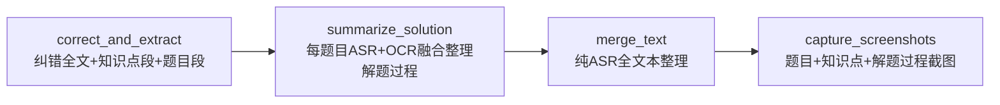

# 解题过程 ASR+OCR 融合提取设计

> 版本：v1.0（已确认）
> 日期：2026-09-01
> 状态：已定案，推进实现
> 所属模块：M8 题目提取模块（扩展）/ pipeline `summarize_solution` 阶段
> 关联 issue：#13 [F-003]
> 前置文档：02_架构设计.md、08_文字对比定位核心算法.md、R-008 OCR选型定案

---

## 一、设计目标

### 1.1 解决的问题

当前 `problem_extractor` 的解题步骤只用 ASR 文字，老师一边讲一边在板书的推导过程（公式、步骤）丢失。需融合 ASR + OCR 两个信息源，还原完整解题过程。

### 1.2 需求（issue #13）

1. 综合 ASR 语音文字 + OCR 板书文字（含公式 LaTeX）整理解题过程
2. 解题过程截图保留用作 debug
3. OCR 不加颜色过滤（保留彩色板书）
4. ~~混合识别 PRINT_ONLY+HANDWRITTEN_ONLY~~ → **调整为 R-008 定案**：两引擎并行（PP-OCRv6 文字 + PP-FormulaNet 公式）+ LLM 补全手写碎片

> 要求 4 调整理由：当前 OCR 架构无"印刷体/手写体分类"步骤，无法先分类再分别识别合并。R-008 已定案由 LLM 承担手写补全，不依赖 PaddleOCR 区分印刷/手写。

### 1.3 精度要求

- 解题步骤时间戳：**步骤级**（每步骤起止时间，用于截图定位）
- 公式：LaTeX 格式（PP-FormulaNet 提供，LLM 整合进解题步骤）

---

## 二、阶段定位

### 2.1 pipeline stage 位置

`summarize_solution` 插入在 `correct_and_extract` 之后、`merge_text` 之前：



**依赖关系**：
- 输入依赖 `correct_and_extract` 产出的 `problems`（题目段，含 start_time/end_time）+ `aligned_transcript`（纠错后字级时间戳）+ `ocr_results`（帧 OCR）
- 输出供 `capture_screenshots` 使用（解题过程截图需要 step 时间戳）

### 2.2 归属

**推荐方案**：M8 `problem_extractor` 扩展新方法 `enrich_solution()`，复用 `solution_summary` LLM session。

理由：M8 模块职责已含"解题步骤"（见 02_架构设计.md §3.1 M8 行），扩展方法比新建模块更符合单一职责且避免模块爆炸。`_enrich_with_ocr` 已存在（补充原题），`enrich_solution` 为并列方法（整理解题过程）。

### 2.3 调用粒度

**推荐方案**：每题目独立调用 LLM。

理由：
- 题目片段通常几百字，token 可控
- 每题目独立上下文，LLM 聚焦本题推导
- 单题失败可单独重试，不影响其他题
- 多题目则多次调用（MVP 质量优先，不考虑成本）

---

## 三、输入输出

### 3.1 输入（每题目独立调用）

| 输入 | 来源 | 格式 |
|---|---|---|
| 题目段原文 | `correct_and_extract` 产出的 `problem.segment_text` | str（题目+讲解原文，已定位 start_time/end_time） |
| ASR 字级文本片段 | `aligned_transcript` 按题目时间范围切片 | 带时间戳的文本（用于 LLM 理解讲解 + 回溯步骤时间戳） |
| OCR 帧片段 | `ocr_results` 按题目时间范围过滤 | 文字行 + 公式 LaTeX（不做颜色过滤，保留彩色板书） |

**切片逻辑**：
- ASR 片段：用 `aligned_transcript.get_time_range` 找题目 [start_time, end_time] 对应的字符区间，取该区间文本 + 字级时间戳
- OCR 片段：过滤 `timestamp ∈ [start_time, end_time]` 的 `OCRFrameResult`，拼接所有帧的 `full_text` + 公式 LaTeX

### 3.2 输出

填充 `Problem.solution_steps`，每步骤：

| 字段 | 说明 |
|---|---|
| step_number | 步骤序号 |
| content | ASR+OCR 融合的步骤内容，公式用 LaTeX（如 `求导得 $f'(x) = 2x$`） |
| start_time | 步骤开始时间（秒，用于截图） |
| end_time | 步骤结束时间（秒） |

> **待确认 1**：`SolutionStep` 当前只有单 `timestamp`，建议扩展为 `start_time` + `end_time`（与 `Problem` 一致，便于截图定位和区间分析）。见 §六待确认事项。

---

## 四、LLM prompt 设计

```
你是教学视频解题过程整理助手。请综合以下 ASR 语音文字和 OCR 板书文字，整理出该题目的分步骤解题过程。

【ASR 片段】（带时间戳，老师口头讲解）
{asr_segment}

【OCR 板书片段】（含公式 LaTeX，板书推导过程）
{ocr_segment}

【题目原文】
{question_text}

【要求】
1. 综合ASR讲解和OCR板书，分步骤整理解题过程
2. 每步骤标注开始时间和结束时间（秒，从ASR时间戳回溯）
3. 公式用LaTeX（如 $f'(x)=2x$），优先采用OCR的LaTeX结果
4. OCR手写碎片（识别不全的板书）结合ASR上下文由你补全还原
5. 保持步骤顺序与老师讲解/板书顺序一致
6. 输出JSON数组，紧凑无缩进：
[{"step_number":1,"content":"步骤内容","start_time":323.0,"end_time":380.0}]
```

**LLM 任务映射**：`config.tasks.solution_summary`（已存在），temperature 0.2（整理类任务偏低）。

---

## 五、解题过程截图

### 5.1 截图策略

每个解题步骤截**一帧**（用 `step.start_time`），复用 `FrameExtractor.extract_frame_at` 的 ffmpeg 单帧提取。

**不做颜色过滤**（保留原画面，与题目截图区别：题目截图做颜色过滤去除彩色手写保留黑色印刷原题；解题过程截图保留全部画面供 debug 参考）。

### 5.2 输出路径

```
debug/{视频名}/06_截图/解题过程/
    题目01_步骤01_t=05m23s.jpg
    题目01_步骤02_t=06m10s.jpg
    题目02_步骤01_t=12m05s.jpg
    ...
```

文件名格式：`题目{problem_index:02d}_步骤{step_number:02d}_t={mm}m{ss}s.jpg`

### 5.3 实现位置

`ScreenshotCapture` 新增 `capture_solution_screenshots(video_path, problems, output_dir)`，遍历 `problem.solution_steps` 截图。pipeline `_stage_capture_screenshots` 追加调用。

---

## 六、已定案决策

| 项 | 定案 |
|---|---|
| 1. SolutionStep 字段 | 扩展 `start_time` + `end_time`（删除 `timestamp`），同步 00_数据模型.md |
| 2. 调用粒度 | 每题目独立调用 LLM |
| 3. stage 位置 | `correct_and_extract` 后、`merge_text` 前 |
| 4. 归属 | M8 `problem_extractor` 扩展 `enrich_solution` |
| 5. 截图粒度 | 每步骤一帧 |
| 6. ASR 片段格式 | 带字级时间戳的原文 |

---

## 七、与现有设计的关系

- **与 08 文字对比定位的关系**：本设计不新增文字定位算法。题目段已由 `correct_and_extract` 通过 08 的定位机制获得 start_time/end_time。解题步骤的时间戳由 LLM 从 ASR 片段时间戳直接回溯（步骤级精度，不需要 08 的字符级精确定位）。
- **与 R-008 的关系**：OCR 两引擎并行 + LLM 补全手写，是本设计 OCR 输入的来源。不做颜色过滤符合 R-008"颜色过滤降级 P2"定案。
- **与 H2 合并调用的关系**：`correct_and_extract` 一次调用返回题目段（原文），`summarize_solution` 是题目段基础上的独立二次调用（解题过程整理需要 OCR 片段，OCR 在 correct_and_extract 之前已产出，但融合整理是不同任务，不宜塞进 correct_and_extract）。
