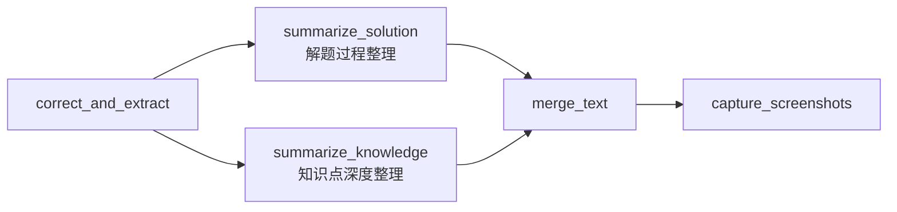

# 知识点深度整理设计

> 版本：v1.0（已确认）
> 日期：2026-09-01
> 状态：已定案，推进实现
> 所属模块：M7 知识点提取模块（扩展）/ pipeline `summarize_knowledge` 阶段
> 关联 issue：#9 [A-004]
> 前置文档：02_架构设计.md、09_解题过程ASR_OCR融合提取设计.md（对称设计）

---

## 一、设计目标

### 1.1 解决的问题

当前 `KnowledgePoint` 只有 `index/name/start_time/confidence`，没有深度整理内容。需将知识点段（ASR 原文）+ OCR 文字综合交给 LLM，输出核心内容（老师讲解总结，公式 LaTeX 嵌入）+ 补充内容（豆包补充，高考范围）。

### 1.2 需求（issue #9）

1. ASR 语音文字 + OCR 文字综合交给 LLM
2. 总结老师讲解（重点分析问题/解决问题的过程）
3. 公式用 LaTeX，**嵌入讲解过程中，不单独列**
4. 豆包补充（老师未提及但相关，高考范围内），标注"补充"
5. 知识点截图保存（不输入 LLM）——**已由 issue #12 实现**
6. LLM 用豆包，开启逻辑推理（config `knowledge_summary` 任务，temperature 0.3）

### 1.3 与 #13 的对称性

本设计与 09 设计（解题过程整理）对称：
- #13：题目段 → 解题过程整理（`summarize_solution`，输出 solution_steps 列表）
- #9：知识点段 → 知识点深度整理（`summarize_knowledge`，输出 content + supplement 文本）

差异：#9 输出是单知识点两段文本（非列表），不需要步骤时间戳，截图已实现。

---

## 二、阶段定位

### 2.1 pipeline stage 位置

`summarize_knowledge` 与 `summarize_solution` 并列（都依赖 `correct_and_extract`，无相互依赖），放在 `summarize_solution` 之后：



### 2.2 归属

M7 `knowledge_extractor` 扩展新方法 `enrich_knowledge()`，复用 `knowledge_summary` LLM session（temperature 0.3，config 已存在）。

### 2.3 调用粒度

每知识点独立调用 LLM（套用 #13 决策）。

---

## 三、输入输出

### 3.1 输入（每知识点独立调用）

| 输入 | 来源 | 格式 |
|---|---|---|
| 知识点段原文 | `correct_and_extract` 产出的 KnowledgePoint.name + 定位到的 ASR 段 | str |
| ASR 字级文本片段 | `aligned_transcript` 按知识点时间范围切片 | 带时间戳的文本 |
| OCR 帧片段 | `ocr_results` 按知识点时间范围过滤 | 文字行 + 公式 LaTeX（不颜色过滤） |

**关键前置**：`KnowledgePoint` 扩展 `end_time` 字段。`content_extractor._locate_knowledge_points` 已通过 `_locate_segment` 定位到 `end_time`，当前被丢弃（行 369-374 只存 start_time），需补存。

### 3.2 输出

填充 `KnowledgePoint` 两个新字段：

| 字段 | 说明 |
|---|---|
| content | 核心内容：老师讲解总结，公式 LaTeX 嵌入其中（如 `二次函数 $f(x)=ax^2+bx+c$ 的图像...`） |
| supplement | 补充内容：豆包补充的相关知识（高考范围内），标注"补充" |

---

## 四、LLM prompt 设计

```
你是教学视频知识点深度整理助手。请综合以下 ASR 语音文字和 OCR 板书文字，整理该知识点的深度内容。

【ASR 片段】（老师口头讲解）
{asr_segment}

【OCR 板书片段】（含公式 LaTeX）
{ocr_segment}

【知识点名称】
{knowledge_name}

【要求】
1. 核心内容：总结老师对该知识点的讲解，重点是老师分析问题和解决问题的过程
2. 公式用 LaTeX 嵌入在讲解过程中（如 $f(x)=ax^2+bx+c$），不单独列公式段
3. 补充内容：补充老师未提及但相关的知识，范围不超出高考，标注"补充"
4. 输出 JSON，紧凑无缩进、无Markdown代码块：
{"content":"核心内容...","supplement":"补充内容..."}
```

---

## 五、已定案决策（套用 #13 + #9 特有）

| 项 | 定案 |
|---|---|
| 1. KnowledgePoint 字段 | 扩展 `end_time` + `content` + `supplement`，同步 00_数据模型.md |
| 2. 调用粒度 | 每知识点独立调用 LLM |
| 3. stage 位置 | 与 `summarize_solution` 并列，放其后 |
| 4. 归属 | M7 `knowledge_extractor` 扩展 `enrich_knowledge` |
| 5. 截图 | 已实现（issue #12，不重复） |
| 6. ASR 片段格式 | 带字级时间戳的原文切片 |
| 7. 公式处理 | LaTeX 嵌入讲解（不单独列） |
| 8. 补充内容 | 独立 supplement 字段，标注高考范围 |

---

## 六、与现有设计的关系

- **与 09 设计（#13）的关系**：对称设计，同为 correct_and_extract 之后的独立 LLM 调用。切片逻辑相同（ASR 按时间范围、OCR 按帧过滤）。
- **与 issue #12 的关系**：知识点截图已实现（capture_knowledge_screenshots），本设计不重复，仅整理文本内容。
- **与 content_extractor 的关系**：`_locate_knowledge_points` 需补存 `end_time`（当前丢弃），供本设计切片使用。
