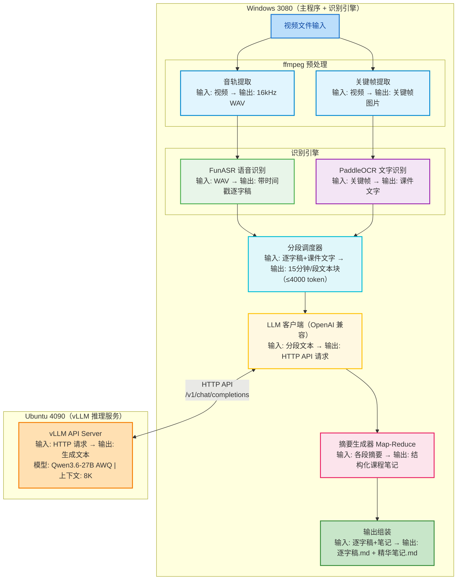
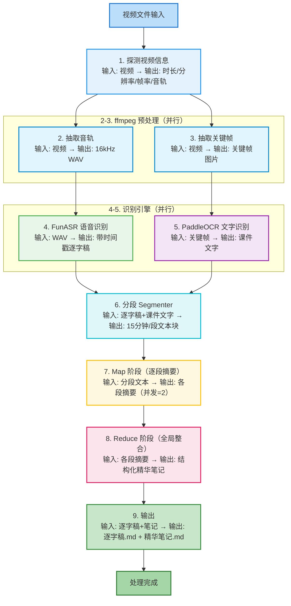

# 教学视频内容提取与总结软件 — 设计方案

> 版本：v1.0
> 日期：2026-08-23
> 状态：待确认

---

## 一、整体架构

双机分离部署，通过局域网 HTTP API 通信：



---

## 二、模块划分

| 模块 | 文件 | 职责 | 依赖 |
|---|---|---|---|
| 配置管理 | `config.py` + `config.yaml` | 加载/校验配置，集中管理所有参数 | pyyaml |
| 音轨提取 | `core/audio_extractor.py` | ffmpeg 抽取音轨，转 16kHz mono WAV | ffmpeg |
| 关键帧提取 | `core/frame_extractor.py` | ffmpeg 按间隔抽帧，场景变化检测 | ffmpeg, opencv |
| 语音识别引擎 | `core/asr_engine.py` | FunASR 封装，输出带时间戳的逐字稿 | funasr, modelscope, torch |
| 文字识别引擎 | `core/ocr_engine.py` | PaddleOCR 封装，识别关键帧文字 | paddleocr, paddlepaddle |
| 分段调度器 | `core/segmenter.py` | 智能切分（重叠+边界微调），合并 ASR+OCR，控制 token 数 | tiktoken |
| LLM 客户端 | `core/llm_client.py` | 双后端统一调用（本地vLLM + DeepSeek云端），流式/重试/缓存 | openai |
| 摘要生成器 | `core/summarizer.py` | Refine顺序滚动 + Reduce全局整合(云端) + 结构化重构(云端) + 润色 | llm_client |
| 输出组装 | `core/writer.py` | 生成逐字稿.md 和精华笔记.md | — |
| 主流程编排 | `core/pipeline.py` | 串联所有模块，断点续传，错误处理 | 全部 |
| 工具集 | `utils/` | token计数、时间戳格式化、日志 | — |
| 入口 | `main.py` | CLI 参数解析，启动 pipeline | — |

---

## 三、处理流程



---

## 四、关键数据结构

```python
from dataclasses import dataclass, field
from typing import Optional

@dataclass
class TimestampedText:
    """带时间戳的文本片段（ASR 或 OCR 结果）"""
    start: float              # 起始时间（秒）
    end: float                # 结束时间（秒）
    text: str                 # 文本内容
    source: str               # "asr" 或 "ocr"
    confidence: float = 1.0  # 置信度（OCR 用）

@dataclass
class VideoSegment:
    """视频分段"""
    index: int                         # 段序号（从0开始）
    start: float                       # 起始时间（秒）
    end: float                         # 结束时间（秒）
    asr_texts: list[TimestampedText] = field(default_factory=list)
    ocr_texts: list[TimestampedText] = field(default_factory=list)
    summary: Optional[str] = None      # Map 阶段生成的段落实质摘要
    summary_tokens: int = 0            # 摘要 token 数
    status: str = "pending"            # pending / processing / done / failed

@dataclass
class VideoInfo:
    """视频元信息"""
    path: str
    duration: float          # 总时长（秒）
    width: int
    height: int
    fps: float
    audio_codec: str
    size_bytes: int

@dataclass
class ProcessResult:
    """完整处理结果"""
    video_info: VideoInfo
    full_transcript: list[TimestampedText]   # 全量逐字稿
    segments: list[VideoSegment]              # 分段及摘要
    final_notes: str                          # 全局精华笔记
    output_dir: str                           # 输出目录
```

---

## 五、分段策略（Map-Reduce + 重叠 + 上下文）

### 5.1 设计原则

**核心问题**：纯时间或纯 token 分段会导致语义割裂——知识点被切断、LLM 缺乏上下文，摘要质量大幅下降。

**解决思路**：不追求"完美切分"（不可能），而是让 LLM 在处理每段时都能看到足够上下文：
1. **重叠**：相邻两段共享 ~500 token 重叠区，消除句子级割裂
2. **带上下文的 Map**：每段输入包含前一段摘要，LLM 知道"这是在什么基础上讲的"
3. **智能边界**：切分点优先选知识点结束的信号，而非硬切

### 5.2 分段参数

| 参数 | 默认值 | 说明 |
|---|---|---|
| `target_input_tokens` | 3000 | 每段目标输入 token（留1000给输出+prompt） |
| `max_input_tokens` | 4000 | 每段硬上限，超过必须细分 |
| `overlap_tokens` | 500 | 相邻两段重叠 token 数（约1-2分钟） |
| `max_output_tokens` | 1500 | 每段输出最大 token |
| `boundary_search_window` | 60 | 切分点微调搜索窗口（秒） |

### 5.3 切分点优先级

在候选切分点前后 ±60秒 范围内寻找最佳切分点，优先级从高到低：

1. **OCR 课件标题变化**：课件页切换了，说明知识点结束（PPT教学视频最有效）
2. **ASR 过渡词**："接下来"、"下面"、"我们来看"、"总结一下"、"首先/其次/最后"
3. **句子边界**：句号、问号、感叹号（避免在一句话中间切断）
4. **VAD 长停顿**：>2秒 的静音段（老师讲完知识点通常会停顿）
5. **原时间点**：以上都没有，用原候选点

### 5.4 分段算法

```
输入：全量 ASR 文本（带时间戳）+ OCR 文本（带时间戳）
输出：VideoSegment 列表（含重叠）

1. 粗分：按 target_input_tokens（3000 token）累计 ASR 文本，给出候选切分点
2. 微调：对每个候选切分点，在 ±60秒 范围内按 5.3 优先级找最佳切分点
3. 重叠：每段的结束时间 = 下一段的开始时间 + overlap_tokens 对应的时长
   （即段 N 的文本包含 [start_N, end_N]，段 N+1 包含 [start_{N+1}, end_{N+1}]，
    其中 start_{N+1} < end_N，形成重叠区）
4. 校验：每段实际 token ≤ max_input_tokens（4000），超过则在该段中间再找最佳切分点二分
5. 输出：VideoSegment 列表，每段含 asr_texts、ocr_texts、start、end
```

### 5.5 带上下文的 Map 阶段

每段调用 LLM 时，输入结构为：

```
【上一段摘要】{prev_segment_summary}
（第一段为空）

【本段时间范围】{start_time} - {end_time}

【本段语音识别文字】
{asr_text}

【本段课件截图文字】
{ocr_text}

任务：基于上一段摘要提供的上下文，生成本段精华摘要。
```

**关键**：Map 阶段各段仍可并行（并发=2），只是每段输入多了前一段摘要。第一段的 prev_summary 为空。

### 5.6 Reduce 阶段

```
1. 收集所有段的摘要（按段序号排序）
2. 去重：重叠区产生的重复内容，LLM 在 Reduce 阶段自动合并
3. 若总 token > 4000：
   a. 对摘要列表做二次分组（每 4-5 段一组）
   b. 每组调用 LLM 做"摘要的摘要"
   c. 合并二次摘要后再做最终 Reduce
4. 调用 LLM 生成全局精华笔记（结构化、带时间戳引用、知识点清单）
```

> **效果验证**：本方案为 MVP 初始设计，实际效果需通过真实视频测试验证。如摘要质量不达标，可调整 overlap_tokens、切分点优先级，或升级为 Refine 顺序处理模式（牺牲并行换连贯性）。

---

## 六、LLM 客户端设计

### 6.1 设计原则

**MVP 阶段质量优先，不考虑速度**。目标是验证"能否产出高质量教学笔记"，而非"处理速度有多快"。速度是 P2 优化的事。

因此：
- 不追求并发，顺序执行
- 重试直到成功（或达上限），失败则中断报错而非跳过
- 用最强的模型处理最关键的阶段

### 6.2 双后端架构

LLM 客户端同时支持两个后端，统一接口，按阶段选择：

| 后端 | 模型 | 上下文 | 成本 | 用途 |
|---|---|---|---|---|
| **本地 4090 vLLM** | Qwen3.6-27B AWQ | 8K | 免费 | Map、Refine、润色等短上下文、调用次数多的阶段 |
| **DeepSeek 云端** | deepseek-chat (V3) | 128K | 极低（约¥0.03/次） | Reduce 全局整合、结构化重构等需要强模型智力和长上下文的阶段 |

### 6.3 后端选择策略

使用云端 API 的两个条件（满足任一即切云端）：

1. **上下文超限**：本地 8K 装不下时，自动切云端（兜底）
2. **主动选择**：Reduce 阶段直接用云端，不是因为装不下，而是因为全局整合需要更强的模型智力，DeepSeek-V3 比本地 Qwen3.6-27B AWQ 更适合

各阶段后端分配：

| 阶段 | 后端 | 原因 |
|---|---|---|
| Map 逐段摘要 | 本地 | 每段短（≤6K），调用次数多，本地免费 |
| Refine 滚动摘要 | 本地 | 滚动摘要控制在≤4K，每段输入≤6K，8K够用 |
| Reduce 全局整合 | **DeepSeek 云端** | 主动选择，强模型做全局整合，128K无压力 |
| 结构化重构 | **DeepSeek 云端** | Reduce 延伸，需要全局视角 |
| 润色格式化 | 本地 | 输入短，本地够用 |

### 6.4 调用方式

使用 **openai SDK**，设置 `base_url` 指向对应后端：

```python
from openai import OpenAI

local_client = OpenAI(base_url="http://192.168.x.x:8000/v1", api_key="EMPTY")
cloud_client = OpenAI(base_url="https://api.deepseek.com/v1", api_key=os.environ["DEEPSEEK_API_KEY"])
```

**流式响应（stream=True）**：
- 长输出不会超时
- 每个 chunk 设单独超时（30秒无数据则超时）
- 不设整体超时

### 6.5 重试策略

| 错误类型 | 重试？ | 处理 |
|---|---|---|
| 网络超时 / 连接重置 | ✅ 重试 | 指数退避 5s→10s→20s |
| HTTP 5xx（服务器错误） | ✅ 重试 | 同上 |
| vLLM 队列满 / 503 | ✅ 重试 | 等待后恢复 |
| HTTP 4xx（请求格式错误） | ❌ 不重试 | 代码 bug，直接报错中断 |
| 模型不存在 / 404 | ❌ 不重试 | 配置错误，直接报错中断 |

**最大重试次数：5次**。全部失败则中断整体流程并报错（MVP 质量优先，不跳过）。

### 6.6 结果缓存（断点续传）

- 缓存 key：输入文本 hash + 模型名 + temperature + max_tokens
- 缓存格式：JSON 文件，存 `cache/llm/{hash}.json`
- 重新运行时先查缓存，命中则跳过请求
- **强制启用缓存**（MVP 调试阶段，方便重跑和对比）

### 6.7 超时设置

| 超时类型 | 值 | 说明 |
|---|---|---|
| 连接超时 | 10s | 建立 TCP 连接 |
| 流式 chunk 超时 | 30s | 单个 chunk 无数据则超时 |
| 整体超时 | 无 | 流式不设整体超时，靠 chunk 超时 |

---

## 七、LLM Prompt 设计

### 7.1 Map 阶段 Prompt（带上下文的单段总结）

```
你是一个专业的教学内容总结助手。以下是一段教学视频的内容，包含上一段摘要（提供上下文）和本段的语音识别文字、课件截图文字。请基于上下文生成本段的精华摘要。

【要求】
1. 提取核心知识点、定义、公式、定理、推导过程
2. 保留关键数字、日期、人名、术语
3. 按逻辑结构组织，使用小标题分层
4. 数学公式使用 LaTeX 格式（行内公式用 $...$，独立公式用 $$...$$）
5. 不要输出客套话、开场白、结束语
6. 不要编造视频中没有提到的内容
7. 如果内容中有例题或习题，保留题目和关键解题步骤
8. 注意与上一段内容的衔接，如果本段是上一段知识点的延续，明确标注

【上一段摘要】
{prev_segment_summary}
（第一段为空，此时直接基于本段内容生成摘要）

【本段时间范围】{start_time} - {end_time}

【本段语音识别文字】
{asr_text}

【本段课件截图文字】
{ocr_text}

【输出格式】
### 本段核心内容
（2-3句话概括本段主题，注意与上一段的衔接）

### 知识点详解
（分点列出，公式用 LaTeX）

### 重点/难点标注
（标注 ⭐ 重点，⚠️ 难点）
```

### 7.2 Reduce 阶段 Prompt（全局整合）

```
你是一个专业的教学内容整理助手。以下是一段教学视频各分段的精华摘要，请整合生成一份完整、结构化的课程笔记。

【要求】
1. 按章节/主题重新组织结构，不要简单拼接各段摘要
2. 提取完整的知识框架，建立知识点之间的关联
3. 数学公式使用 LaTeX 格式
4. 重要结论和公式旁标注时间戳引用，格式为 [mm:ss]
5. 标注重点（⭐）和难点（⚠️）
6. 结尾附上"关键知识点清单"（编号列表，每条≤20字）
7. 不要输出客套话
8. 如果视频包含多个主题，按主题分大章

【视频基本信息】
视频时长：{duration}
分段数量：{segment_count}

【各段精华摘要】
{all_segment_summaries}

【输出格式】
# {视频标题} - 课程笔记

## 课程概述
（2-3句话概括整段视频主题）

## 第一章：{主题名}
### 1.1 {子主题}
...

## 关键知识点清单
1. ...
2. ...
...
```

---

## 八、配置文件

```yaml
# config.yaml

# 视频处理参数
video:
  audio_sample_rate: 16000      # FunASR 要求 16kHz
  audio_channels: 1              # mono
  frame_interval: 30             # 每30秒抽一帧（秒）
  scene_change_detection: false  # 是否启用场景变化检测
  scene_change_threshold: 0.3    # 场景变化阈值（0-1）

# 分段参数
segmentation:
  target_input_tokens: 3000     # 每段目标输入 token（留1000给输出+prompt）
  max_input_tokens: 4000         # 每段硬上限
  overlap_tokens: 500             # 相邻两段重叠 token 数
  max_output_tokens: 1500         # 每段输出最大 token
  boundary_search_window: 60      # 切分点微调搜索窗口（秒）
  refine_compress_threshold: 4000 # Refine滚动摘要超过此值则压缩
  refine_compress_target: 2000    # 压缩目标 token 数

# LLM 参数（双后端）
llm:
  # 本地 4090 vLLM
  local:
    base_url: "http://192.168.x.x:8000/v1"
    model: "Qwen3.6-27B-AWQ"
    temperature: 0.3
    top_p: 0.9
  # DeepSeek 云端
  cloud:
    base_url: "https://api.deepseek.com/v1"
    model: "deepseek-chat"
    api_key: "${DEEPSEEK_API_KEY}"  # 从环境变量读取
    temperature: 0.3
    top_p: 0.9
  # 各阶段后端选择
  stage_backend:
    map: "local"
    refine: "local"
    reduce: "cloud"       # 主动选择，用强模型做全局整合
    structure: "cloud"    # 结构化重构
    polish: "local"
  # 通用参数
  max_retries: 5
  connect_timeout: 10
  stream_chunk_timeout: 30
  cache_enabled: true

# FunASR 参数
asr:
  model: "paraformer-zh"        # 识别模型
  punc_model: "ct-punc"         # 标点恢复模型
  vad_model: "fsmn-vad"         # 端点检测模型
  batch_size_s: 300             # 批处理大小（秒）
  device: "cuda"                 # cuda / cpu

# PaddleOCR 参数
ocr:
  use_angle_cls: true            # 启用方向分类
  lang: "ch"                     # 中文
  det_db_box_thresh: 0.5         # 检测框阈值
  use_gpu: true

# 输出参数
output:
  transcript_filename: "逐字稿.md"
  notes_filename: "精华笔记.md"
  timestamp_format: "mm:ss"      # mm:ss 或 hh:mm:ss
  include_ocr_in_transcript: false  # 逐字稿中是否包含 OCR 文字
  formula_latex: true             # 公式是否用 LaTeX

# 路径参数
paths:
  cache_dir: "./cache"           # 中间结果缓存目录
  output_dir: "./output"         # 输出目录
  temp_dir: "./temp"             # 临时文件目录
```

---

## 九、错误处理与容错

| 错误场景 | 处理策略 | 用户感知 |
|---|---|---|
| LLM 调用超时 | 重试 3 次，指数退避（5s/10s/20s） | 日志提示，不中断 |
| LLM 调用全部失败 | 该段标记 `[摘要生成失败]`，继续处理其他段 | 输出中标注失败段 |
| FunASR 识别失败 | 回退 CPU 推理；仍失败则跳过该音频段 | 逐字稿中标注缺失 |
| PaddleOCR 识别失败 | 跳过该帧，不影响整体流程 | 笔记中可能缺少部分课件文字 |
| ffmpeg 抽音轨失败 | 检查视频编码，尝试转码后重试 | 明确报错提示 |
| 显存不足（OOM） | ASR/OCR 顺序执行不同时加载；降低 batch_size | 自动降级 |
| 网络中断（4090不可达） | 暂停处理，提示检查网络；支持断点续传 | 明确报错，可恢复 |
| 磁盘空间不足 | 检测剩余空间，不足时提示并暂停 | 明确报错 |

### 断点续传机制

- 每个阶段的中间结果都缓存到 `cache/` 目录
- 重新运行时检测缓存，跳过已完成的步骤
- 缓存文件命名：`{视频hash}_{阶段}.json`
- 可通过 `--force` 参数强制重新处理

---

## 十、目录结构

```
videocontents/
├── main.py                      # CLI 入口
├── config.py                    # 配置加载与校验
├── config.yaml                  # 默认配置
├── requirements.txt             # Python 依赖
├── README.md                    # 使用说明
│
├── core/
│   ├── __init__.py
│   ├── pipeline.py              # 主流程编排（核心）
│   ├── audio_extractor.py       # ffmpeg 抽音轨
│   ├── frame_extractor.py       # ffmpeg 抽关键帧
│   ├── asr_engine.py            # FunASR 语音识别封装
│   ├── ocr_engine.py            # PaddleOCR 文字识别封装
│   ├── segmenter.py             # 分段调度器
│   ├── llm_client.py            # vLLM API 客户端
│   ├── summarizer.py            # Map-Reduce 摘要生成
│   └── writer.py                # Markdown 输出组装
│
├── utils/
│   ├── __init__.py
│   ├── token_counter.py         # token 计数（tiktoken 封装）
│   ├── timestamp.py             # 时间戳格式化工具
│   ├── video_probe.py           # ffprobe 视频信息探测
│   └── logger.py                # 日志配置
│
├── prompts/
│   ├── map_prompt.txt           # Map 阶段 prompt 模板
│   └── reduce_prompt.txt        # Reduce 阶段 prompt 模板
│
├── tests/
│   ├── test_segmenter.py
│   ├── test_llm_client.py
│   └── test_writer.py
│
├── cache/                       # 中间结果缓存（gitignore）
│   ├── audio/
│   ├── frames/
│   ├── asr/
│   ├── ocr/
│   └── summaries/
│
├── output/                      # 输出目录（gitignore）
│   └── {视频名}/
│       ├── 逐字稿.md
│       └── 精华笔记.md
│
└── temp/                        # 临时文件（gitignore）
```

---

## 十一、MVP 范围与迭代计划

### P1（MVP，当前目标）

| 功能 | 状态 | 说明 |
|---|---|---|
| CLI 命令行界面 | ✅ 必做 | `python main.py <视频路径>` |
| ffmpeg 抽音轨 | ✅ 必做 | 16kHz mono WAV |
| ffmpeg 抽关键帧 | ✅ 必做 | 每30秒一帧 |
| FunASR 语音识别 | ✅ 必做 | paraformer-zh + 标点 + VAD |
| PaddleOCR 文字识别 | ✅ 必做 | 关键帧 OCR + 去重 |
| 分段 Map-Reduce | ✅ 必做 | 15分钟切片，token≤4000 |
| vLLM API 调用 | ✅ 必做 | OpenAI 兼容格式，并发=2 |
| 输出逐字稿.md | ✅ 必做 | 带时间戳的全量 ASR 文本 |
| 输出精华笔记.md | ✅ 必做 | 结构化笔记，公式 LaTeX |
| 断点续传 | ✅ 必做 | 中间结果缓存 |
| 错误处理与重试 | ✅ 必做 | LLM 重试，失败降级 |
| 配置文件 | ✅ 必做 | config.yaml |

### P2（后续迭代）

| 功能 | 优先级 | 说明 |
|---|---|---|
| GUI 图形界面 | 高 | PyQt/Tkinter，拖拽视频，进度条 |
| 公式 OCR → LaTeX | 高 | 集成 LaTeX-OCR 模型，公式精准识别 |
| 说话人分离 | 中 | FunASR speaker diarization，区分老师/学生 |
| 批量处理队列 | 中 | 多视频排队处理 |
| 实时进度显示 | 中 | 当前阶段、百分比、预计剩余时间 |
| 视频预览跳转 | 低 | 点击时间戳跳转到视频对应位置 |
| 多语言支持 | 低 | 英文/日文教学视频 |
| 导出 PDF/HTML | 低 | 笔记格式转换 |

---

## 十二、关键设计决策与理由

| 决策 | 选择 | 理由 | 被否决的方案 |
|---|---|---|---|
| 推理部署 | 双机分离（3080识别+4090推理） | 3080 10GB 跑不动 27B 模型；4090 24GB 专用于推理不浪费 | 单机全跑（3080跑小模型，质量差） |
| **MVP优先级** | **质量优先，不考虑速度** | MVP验证"能否产出高质量笔记"，速度是P2优化的事；质量不行项目无意义 | 速度优先（并发优化，牺牲质量） |
| **摘要策略** | **Refine顺序滚动 + Reduce云端整合** | Refine每段带完整上下文，连贯性最好；Reduce用云端强模型做全局整合 | 纯Map-Reduce（各段独立，信息损失大）；纯Refine（早期内容遗忘） |
| **LLM后端** | **双后端（本地vLLM + DeepSeek云端）** | 量大短任务用本地免费；Reduce等需要强智力+长上下文的任务用云端 | 纯本地（8K上下文不够，模型智力有限）；纯云端（成本高，Map阶段浪费） |
| **云端使用条件** | **超8K兜底 + Reduce主动选择** | 不是本地搞不定才用云端，而是Reduce天然该交给更强的模型 | 仅在本地超限时用云端（错过强模型的价值） |
| 分段策略 | 目标3000 token + 500重叠 + 智能边界 | 重叠消除句子级割裂；智能边界优先选知识点结束处 | 纯时间切分（可能切断知识点）；纯token切分（可能在句中切断） |
| 执行方式 | 顺序执行（无并发） | MVP质量优先，顺序执行确保每段带准确的上一段摘要 | 并发执行（快但段间上下文依赖无法满足） |
| OCR 策略 | 关键帧（每30秒一帧） | 1.5小时=180帧，计算量可控；课件变化频率低 | 全帧 OCR（12万帧，计算量爆炸）；场景变化检测（实现复杂，收益有限） |
| 公式处理 | P1 纯文本，P2 转 LaTeX | PaddleOCR 对公式识别效果一般；LaTeX-OCR 需要额外模型 | P1 就做 LaTeX（模型复杂，MVP 周期长） |
| LLM 调用格式 | OpenAI 兼容 API | vLLM 和 DeepSeek 都支持，代码统一；切换后端只需改 base_url | 直接用 vLLM Python API（耦合度高，不支持双后端） |
| 重试策略 | 重试5次，失败则中断 | MVP质量优先，不跳过失败段，确保结果完整 | 失败标记跳过（快但结果不完整） |
| 输出格式 | Markdown | 公式 LaTeX 兼容，易于阅读和后续转换 | 纯文本（公式无法渲染）；HTML（复杂） |

---

## 十三、性能预估

> MVP 阶段质量优先，不优化速度。以下为预估时间，实际取决于视频长度和语音密度。

基于 1.5小时教学视频、Qwen3.6-27B AWQ（本地8K）+ DeepSeek-V3（云端128K）：

| 阶段 | 后端 | 预估时间 | 说明 |
|---|---|---|---|
| 抽音轨 | 本地 | ~10秒 | ffmpeg 快速 |
| 抽关键帧 | 本地 | ~5秒 | 180帧 |
| FunASR 识别 | 本地GPU | ~3-5分钟 | 约 30x 实时 |
| PaddleOCR 识别 | 本地GPU | ~1-2分钟 | 180帧 |
| 分段调度 | 本地CPU | ~5秒 | token统计+边界搜索 |
| Refine 滚动摘要（N段顺序） | 本地vLLM | ~5-8分钟 | 每段约30-60秒，顺序执行 |
| Reduce 全局整合 | DeepSeek云端 | ~30-60秒 | 128K上下文，一次调用 |
| 结构化重构 | DeepSeek云端 | ~30-60秒 | 一次调用 |
| 润色格式化 | 本地vLLM | ~20-30秒 | 一次调用 |
| 输出组装 | 本地 | ~5秒 | 写文件 |
| **总计** | | **~10-15分钟** | |

> 主要耗时项：FunASR 识别（3-5分钟）+ Refine 滚动摘要（5-8分钟）。云端 API 调用约 ¥0.05/次，成本可忽略。
>
> P2 优化方向：Refine 阶段可改为"两轮并发"（第一轮无上下文并发生成初稿，第二轮带初稿并发生成终稿），预计可将 Refine 时间减半。

---

*文档结束*
