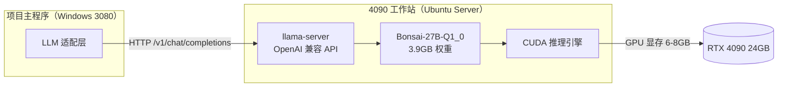

# 4090 工作站 Bonsai-27B llama.cpp 部署文档

> 文档版本：v1.0  
> 创建日期：2026-08-28  
> 适用对象：教学视频内容提取与总结工具 — 本地 LLM 备选推理节点

---

## 1. 概述

本文档记录在 NVIDIA RTX 4090 工作站（Ubuntu Server）上，通过 PrismML 定制版 llama.cpp 部署 **Bonsai-27B-Q1_0（1-bit 量化）** 大模型的完整流程，包括编译、模型下载、性能测试、systemd 开机自启服务配置。

Bonsai-27B 是 PrismML 基于 Qwen3.6-27B 推出的 1-bit / 三值量化模型，采用混合注意力架构（~75% 线性注意力 + ~25% 全注意力），原生支持 262K 上下文，权重仅 3.9GB，在 4090 上可实现 100+ t/s 的推理速度。

---

## 2. 硬件与系统环境

| 项目 | 规格 |
|---|---|
| GPU | NVIDIA RTX 4090 24GB |
| 操作系统 | Ubuntu Server 24.04 LTS |
| Python | 3.12（系统自带，PEP 668 保护） |
| CUDA | 需提前安装并验证 |
| 数据盘 | 独立 4TB 数据盘（挂载于 `~/disk4tb/`） |

### 2.1 目录约定

| 用途 | 路径 |
|---|---|
| llama.cpp 源码 | `~/disk4tb/llama.cpp/` |
| 模型文件 | `~/disk4tb/hfmodels/` |
| 编译产物 | `~/disk4tb/llama.cpp/build/bin/` |

---

## 3. 软件版本

| 组件 | 版本 / 来源 | 说明 |
|---|---|---|
| llama.cpp | PrismML fork（commit b10660-e311ed38f） | **必须用此 fork**，主线不支持自定义 1-bit 量化格式 |
| 模型 | prism-ml/Bonsai-27B-gguf (Q1_0) | 官方仓库，Apache 2.0 |
| OpenSSL | libssl-dev（apt） | llama-server HTTPS 支持依赖 |
| CMake | 3.16+ | 编译构建 |
| CUDA Toolkit | 与驱动匹配 | 编译时 `-DGGML_CUDA=ON` |

---

## 4. 部署架构



---

## 5. 安装步骤

### 5.1 系统依赖安装

```bash
sudo apt update
sudo apt install -y build-essential cmake git libssl-dev
```

- `build-essential`：gcc/g++ 编译工具链
- `cmake`：构建系统
- `git`：克隆源码
- `libssl-dev`：llama-server 的 HTTPS / OpenAI API TLS 支持（缺失会导致 CMake Warning，但不影响纯 HTTP）

### 5.2 CUDA 环境验证

```bash
# 验证 NVIDIA 驱动
nvidia-smi

# 验证 CUDA Toolkit（实际安装的版本）
nvcc --version

# 查看 CUDA 安装目录
ls /usr/local/cuda*/
```

> **注意**：`nvidia-smi` 显示的是驱动支持的最高 CUDA 版本，`nvcc --version` 才是实际安装的 Toolkit 版本，两者不一致属正常现象。若 `nvcc` 命令不存在，需先安装 CUDA Toolkit 或配置 PATH。

### 5.3 克隆 PrismML 定制版 llama.cpp

```bash
cd ~/disk4tb
git clone https://github.com/PrismML-Eng/llama.cpp.git
cd llama.cpp
```

> **关键**：必须使用 PrismML fork。Bonsai 的 Q1_0 是自定义 group-wise 1-bit 量化格式（g128），主线 llama.cpp 无法加载。

### 5.4 编译（CUDA 加速）

```bash
cd ~/disk4tb/llama.cpp
cmake -B build -DGGML_CUDA=ON
cmake --build build -j
```

编译成功后，二进制文件位于 `build/bin/`：
- `llama-cli`：命令行推理 / 交互
- `llama-server`：OpenAI 兼容 HTTP API 服务

### 5.5 模型下载

#### 方式一：直接 wget（推荐，零 Python 依赖）

```bash
mkdir -p ~/disk4tb/hfmodels
cd ~/disk4tb/hfmodels

# 官方源（国内可能无法访问）
wget https://huggingface.co/prism-ml/Bonsai-27B-gguf/resolve/main/Bonsai-27B-Q1_0.gguf

# 国内镜像（hf-mirror.com，稳定可用）
wget https://hf-mirror.com/prism-ml/Bonsai-27B-gguf/resolve/main/Bonsai-27B-Q1_0.gguf
```

#### 方式二：huggingface_hub CLI（需虚拟环境）

Ubuntu 24.04 启用了 PEP 668，禁止直接 `pip install` 到系统环境：

```bash
sudo apt install -y python3-venv
python3 -m venv ~/hfenv
source ~/hfenv/bin/activate
pip install huggingface_hub

# 国内镜像加速
export HF_ENDPOINT=https://hf-mirror.com
hf download prism-ml/Bonsai-27B-gguf Bonsai-27B-Q1_0.gguf --local-dir ~/disk4tb/hfmodels
```

#### 验证下载

```bash
ls -lh ~/disk4tb/hfmodels/Bonsai-27B-Q1_0.gguf
# 文件大小应约为 3.9GB
```

---

## 6. 模型测试

### 6.1 短上下文快速验证

```bash
cd ~/disk4tb/llama.cpp

./build/bin/llama-cli \
  -m ~/disk4tb/hfmodels/Bonsai-27B-Q1_0.gguf \
  -ngl 99 \
  -c 8192 \
  -p "你好，请用一句话介绍你自己" \
  -n 256
```

参数说明：
- `-ngl 99`：全部层卸载到 GPU（99 为足够大的值，实际层数不足时自动全部加载）
- `-c 8192`：上下文窗口 8K
- `-p`：输入 prompt
- `-n 256`：最大生成 256 token

**预期输出**：模型加载成功，正常生成中文回复，末尾显示速度统计。

### 6.2 32K 长上下文性能测试

#### 生成测试文本

```bash
python3 -c "
text = '数学是研究数量、结构、变化以及空间模型等概念的一门学科。' * 1700
with open('/tmp/long_prompt.txt', 'w') as f:
    f.write(text + '\n\n请总结以上内容的核心观点：')
print(f'写入 {len(text)} 字符，约 {int(len(text)/1.65)} tokens')
"
```

> 中文 token 化比例约 1.65 字符/token。1700 句 × 28 字 ≈ 47600 字符 ≈ 28.8K tokens，留约 4K 给生成，不超 32K 上限。

#### 运行测试

```bash
cd ~/disk4tb/llama.cpp

./build/bin/llama-cli \
  -m ~/disk4tb/hfmodels/Bonsai-27B-Q1_0.gguf \
  -ngl 99 \
  -c 32768 \
  -f /tmp/long_prompt.txt \
  -n 256 \
  --no-mmap
```

> **注意**：`-f` 和 `-p` 不能同时使用（本版本中 `-p` 会覆盖 `-f`）。长文本测试应将 prompt 和问题合并到文件中，仅用 `-f`。

#### 显存监控（另开终端）

```bash
watch -n 0.5 nvidia-smi
```

### 6.3 性能测试结果（4090 实测）

| 测试场景 | Prompt (prefill) | Generation (decode) | 显存占用 |
|---|---|---|---|
| 短上下文（8K） | 111 t/s | 126 t/s | ~6.0 GB |
| 长上下文（32K） | **3069 t/s** | 99 t/s | **6.3 GB** |

**关键发现**：
- 32K 上下文下 prefill 速度高达 3069 t/s，得益于 ~75% 线性注意力层将长序列 prefill 从 O(n²) 降至近似 O(n)
- decode 速度从 126 降至 99 t/s（-22%），因 KV cache 增大导致内存带宽压力上升
- 显存占用仅 6.3GB，24GB 显存剩余 ~17.8GB，可同时运行 FunASR + PaddleOCR 等 GPU 任务

---

## 7. systemd 服务配置（128K 上下文，开机自启）

### 7.1 创建服务文件

```bash
sudo tee /etc/systemd/system/bonsai-llm.service << 'EOF'
[Unit]
Description=Bonsai 27B LLM Server (128K context)
After=network.target

[Service]
Type=simple
User=你的用户名
WorkingDirectory=/home/你的用户名/disk4tb/llama.cpp
ExecStart=/home/你的用户名/disk4tb/llama.cpp/build/bin/llama-server \
  -m /home/你的用户名/disk4tb/hfmodels/Bonsai-27B-Q1_0.gguf \
  --host 0.0.0.0 \
  --port 8080 \
  -ngl 99 \
  -c 131072 \
  --api-key bonsai-local
Restart=always
RestartSec=5

[Install]
WantedBy=multi-user.target
EOF
```

> 将 `你的用户名` 替换为实际系统用户名。`-c 131072` 即 128K 上下文。

### 7.2 启用并启动

```bash
sudo systemctl daemon-reload
sudo systemctl enable bonsai-llm    # 设置开机自启
sudo systemctl start bonsai-llm     # 立即启动
```

### 7.3 128K 显存预算

| 项目 | 占用 |
|---|---|
| 模型权重（Q1_0） | 3.9 GB |
| 128K KV cache（4-bit） | ~2.1 GB |
| CUDA 运行时与计算缓冲 | ~1.7 GB |
| **合计** | **~7.7 GB** |

4090 24GB 显存剩余 ~16GB，充裕。

### 7.4 服务管理命令

```bash
sudo systemctl status bonsai-llm     # 查看状态
sudo systemctl start bonsai-llm      # 启动
sudo systemctl stop bonsai-llm       # 停止
sudo systemctl restart bonsai-llm    # 重启
sudo systemctl disable bonsai-llm    # 取消开机自启

# 查看日志
sudo journalctl -u bonsai-llm -f                    # 实时日志
sudo journalctl -u bonsai-llm --since "10 min ago"  # 最近 10 分钟
```

---

## 8. API 调用

### 8.1 健康检查

```bash
curl http://192.168.x.x:8080/health
# 返回 {"status":"ok"}
```

### 8.2 Chat Completions（OpenAI 兼容）

```bash
curl http://192.168.x.x:8080/v1/chat/completions \
  -H "Content-Type: application/json" \
  -H "Authorization: Bearer bonsai-local" \
  -d '{
    "model": "bonsai",
    "messages": [{"role": "user", "content": "三角形内角和等于多少？"}],
    "max_tokens": 256,
    "temperature": 0.3
  }'
```

### 8.3 Python 调用示例

```python
from openai import OpenAI

client = OpenAI(
    base_url="http://192.168.x.x:8080/v1",
    api_key="bonsai-local"
)

resp = client.chat.completions.create(
    model="bonsai",
    messages=[{"role": "user", "content": "你的问题"}],
    max_tokens=2048,
    temperature=0.3
)
print(resp.choices[0].message.content)
```

---

## 9. 与项目架构对接

根据项目架构约定，LLM 通过适配层隔离，每个调用点可独立配置 provider。建议配置策略：

| 调用点 | 推荐 Provider | 理由 |
|---|---|---|
| ASR 纠错 | 豆包（云端） | 纠错对质量敏感，Q1_0 工具调用退化 -17.5% |
| 知识点提取 | Bonsai（本地） | 文本理解为主，数学退化仅 -3.8%，省成本无延迟 |
| 题目提取 | Bonsai（本地） | 结构化提取，长上下文优势明显 |
| 思维导图生成 | 豆包（云端） | 复杂结构化输出，质量优先 |

在 `config.yaml` 中新增 provider 配置（具体字段以项目适配层接口定义为准）。

---

## 10. 常见问题与排错

### 10.1 CMake 报 OpenSSL not found

**现象**：
```
CMake Warning at vendor/cpp-httplib/CMakeLists.txt:154 (message):
  OpenSSL not found, HTTPS support disabled
```

**解决**：
```bash
sudo apt install -y libssl-dev
rm -rf build
cmake -B build -DGGML_CUDA=ON
cmake --build build -j
```

### 10.2 pip install 报 externally-managed-environment

**现象**：Ubuntu 24.04 禁止直接 pip 安装到系统环境（PEP 668）。

**解决**：
- 仅下载模型：直接用 `wget` + `hf-mirror.com`，无需 Python 依赖
- 必须用 huggingface_hub：创建 venv 虚拟环境（见 5.5 节方式二）
- 不推荐 `--break-system-packages`，可能破坏系统 Python

### 10.3 模型加载失败 / 格式不识别

**现象**：llama.cpp 报错无法识别 GGUF 格式。

**原因**：使用了主线 llama.cpp，而非 PrismML fork。

**解决**：确认源码来自 `https://github.com/PrismML-Eng/llama.cpp`，重新编译。

### 10.4 上下文超限

**现象**：
```
error: request (XXXXX tokens) exceeds the available context size (32768 tokens)
```

**解决**：
- 增大 `-c` 参数（如 `-c 131072`）
- 或减少输入 prompt 长度
- 中文约 1.65 字符/token，据此估算文本长度

### 10.5 `-f` 与 `-p` 同时使用不生效

**现象**：`-f` 指定的文件内容未被加载，仅 `-p` 的内容生效。

**解决**：本版本中两者冲突。将 prompt 内容与问题合并到同一文件，仅使用 `-f`。

### 10.6 国内无法访问 HuggingFace

**解决**：使用镜像站 `https://hf-mirror.com`，替换下载 URL 中的域名即可。

---

## 11. 模型质量参考

Bonsai-27B 有两个量化版本，均基于 Qwen3.6-27B：

| 版本 | 大小 | 有效 bit/weight | 整体得分 | 数学 | 编码 | 工具调用 |
|---|---|---|---|---|---|---|
| FP16 基线 | 54 GB | 16 | 85.0 | 95.3 | 88.7 | 80.0 |
| Ternary | 5.9 GB | 1.71 | 80.5（-5.3%） | 93.4 | 86.0 | 74.0 |
| **Q1_0（本文档）** | **3.9 GB** | **1.125** | **76.1（-10.5%）** | **91.7（-3.8%）** | **81.9（-7.7%）** | **66.0（-17.5%）** |

**结论**：Q1_0 版本在数学和文本理解上退化较小，适合教学视频知识点提取场景；工具调用退化明显，不适合 Agent 化多步推理。若后续需要工具调用能力，可切换 Ternary 版本（5.9GB，4090 同样轻松加载）。

---

## 12. 参考链接

- PrismML 官方公告：https://prismml.com/news/bonsai-27b
- 官方 GGUF 仓库：https://huggingface.co/prism-ml/Bonsai-27B-gguf
- PrismML llama.cpp fork：https://github.com/PrismML-Eng/llama.cpp
- 国内 HuggingFace 镜像：https://hf-mirror.com
