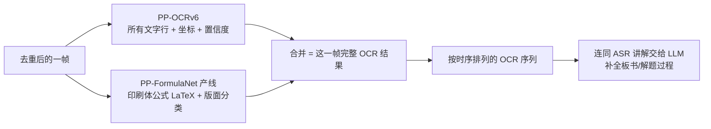

# R-008：OCR 选型横向调研——两引擎并行 + LLM 补全

> **调研日期**: 2026-08-28
> **调研状态**: 已完成
> **前置调研**: R-002（PaddleOCR 手写体能力）、R-007（印刷体/手写体分开识别）、[R-008_附_OCR五方案对比测试报告](R-008_附_OCR五方案对比测试报告.md)

---

## 1. 调研背景

### 1.1 触发原因

用户对既有选型提出根本性质疑：

1. **"Windows/Mac 自带 OCR 很好很快，为什么项目选型不用？而且 PaddleOCR 效果很差"**
2. 既有调研（R-002 → R-007 → 三代对比）始终在 PaddleOCR 生态内做"纵向"验证，**没有横向扫描过其他类别方案**（系统 OCR、公式专家模型、云端多模态 API）
3. 为达成"单模型输出 LaTeX"目标接受了 PaddleOCR-VL 的重代价（9.8GB 显存、32 分钟 JIT 预热、2-6s/帧），没有回头质疑"是否值得"

### 1.2 调研目标

1. 回答"系统自带 OCR 是否满足项目 OCR 需求"
2. 横向扫描公式识别候选方案，用同一测试集实测
3. 基于实测数据重新设计 OCR 方案（单模型 or 混合流水线）

### 1.3 项目 OCR 需求基准（用户确认版）

| # | 需求 | 优先级 |
|---|---|---|
| N1 | 印刷体题目逐字精确（原题主要来源） | 高 |
| N2 | 数学公式输出 LaTeX（讲解中嵌入，不单独列段） | 最高（第一优先级） |
| N3 | 手写板书语义可读（允许错字，下游 LLM 兜底） | 高 |
| N4 | 本地 3080 10GB 优先，公益项目成本极低 | 约束 |
| N5 | 速度配合 1 秒取帧 + 帧变化检测去重可接受 | 约束 |
| N6 | 引擎通过适配层隔离，可更换 | 约束 |

---

## 2. 候选方案横向扫描

### 2.1 系统自带 OCR（用户提出，本轮实测排除）

| 方案 | 能力 | 结论 |
|---|---|---|
| Windows.Media.Ocr（旧版） | 毫秒级、免费、系统内置；但**封闭 API**：无置信度分数、无自定义词库、不可训练、激进的图形抑制器；中文依赖系统语言包 | 实测排除（见 2.3） |
| Windows AI TextRecognizer（新版） | 能力更强，但**必须 Copilot+ NPU 设备**，3080 主机无 NPU | 物理不可用 |
| macOS Vision | 能力优秀（accurate 档 + 候选词），但**仅 Apple 生态** | 物理不可用 |

### 2.2 公式专家模型（本轮调研补上的盲区，实测定案）

| 方案 | 参数量 | 生态 | 备注 |
|---|---|---|---|
| **PP-FormulaNet 系列**（-S/-L/plus-S/M/L） | 37M-2.3B | PaddleOCR 3.7 内置，**venv_paddle3 现成环境零新依赖** | 实测定案（见 2.3） |
| UniMERNet | 0.2-1.3B | 学术界公式识别标杆，PaddleOCR 3.x 已内置封装 | 备选（plus-M 不满足时再测） |
| Pix2Text | 基于 MFR | PyTorch/HF 生态，需新装 torch | 本轮未测（避免双深度学习框架） |
| Texo / UniRec-0.1B | 20M-0.1B | 2026 年新模型，论文验证 | 观察名单 |
| Mathpix（云端） | 商业 API | 公式识别行业标杆 | 公益项目持续成本，暂不采用 |

### 2.3 云端多模态 LLM（辅助通道）

| 方案 | 能力 | 成本 | 定位 |
|---|---|---|---|
| 豆包 Doubao-Seed-Vision | 公式/手写/复杂版面全可 | 输入 0.64-3.2 元/百万 tokens | 疑难帧兜底（账号/适配层现成） |

---

## 3. 实测验证

### 3.1 测试方法

- **测试集**：`scripts/tests/` 7 张教学视频截图（2560x1440，含纯印刷体、纯公式、印刷+手写混合），与三代对比测试完全一致
- **预期基准**：`scripts/ocr_test_expected.md`（多模态视觉模型标注）
- **产出**：
  - `scripts/ocr_test_windows_ocr.py` → `scripts/ocr_results_windows_ocr.md`
  - `scripts/ocr_test_formula.py` → `scripts/ocr_results_formula.md`
  - 汇总对比：[R-008_附_OCR五方案对比测试报告](R-008_附_OCR五方案对比测试报告.md)

### 3.2 Windows 自带 OCR 实测结果（2026-08-28）

| 指标 | 实测值 |
|---|---|
| 速度 | **0.045-0.114s/帧**（全场最快，CPU、零显存、零预热） |
| 印刷体大标题 | ✅ 正确 |
| 印刷体正文 | ❌ 错字（本→朩、中→巾、已→己）+ 丢词 |
| 公式 | ❌ 打平成碎片（`己 知 磊 口 + b ， 0 则 02022`），**无 LaTeX** |
| 手写板书 | ❌ 几乎不可用（"元素完全相同"→"尢 尻 飠 囝"，标注数字全丢） |

**回答用户疑问**：系统 OCR"很快很好"的口碑属实，但仅限普通文字场景。它无公式语义理解（微软官方平台卡明确定位为"常见文本提取"），对项目两大核心需求（N2 公式 LaTeX、N3 手写板书）全部失败。**实测排除。**

### 3.3 PP-FormulaNet_plus-M 公式产线实测结果（2026-08-28）

PaddleOCR 3.7 公式识别产线 = PP-DocLayout_plus-L（版面检测）+ PP-FormulaNet_plus-M（公式识别），venv_paddle3 现成环境直接运行，权重自动下载（129MB + 617MB）。

| 指标 | 实测值 |
|---|---|
| 速度 | 含公式帧 0.96-1.9s，无公式帧 0.1s（**比 VL 快 4-6 倍**） |
| 印刷体公式（图片3） | ✅ **完美 LaTeX**：`\left\{a,\frac{b}{a},1\right\}=\left\{a^{2},a+b,0\right\}` + `a^{2022}+b^{2023}=`，与 VL 同级 |
| 手写解题公式（图片7） | ⚠️ 结构化近似：`a^{2022}+b^{2023}=(-1)^{2022}+b^{2023}=1\rightarrow0=1`（识别出结构链，0^{2023} 误为 b^{2023}；传统 OCR 在此场景全是乱码） |
| 手写短小集合表达式（图片4） | ❌ 版面检测漏检（未判为 formula 区域） |
| 版面分类 | ✅ 免费获得 formula/text/paragraph_title/image/header 分类框 + 置信度（P2 智能裁剪可直接复用） |

**结论**：印刷体公式 LaTeX（N2 主场景）达到 VL 同级质量、速度快 4-6 倍；手写解题公式给出结构化近似（LLM 可修正）；仅手写短小集合表达式漏检（VL 或云端兜底）。

### 3.4 五方案全景对比

| 维度 | v4 | v6 | VL | Windows OCR | PP-FormulaNet |
|---|---|---|---|---|---|
| 印刷体公式 LaTeX | ❌ | ❌ | ✅ | ❌ | ✅ |
| 手写解题公式 | ❌ | ⚠️ | ✅ | ❌ | ⚠️ |
| 印刷体文字 | ✅ | ✅ | ✅ | ⚠️ | ➖ |
| 手写文字 | ⚠️ | ⚠️ | ✅ | ❌ | ➖ |
| 稳态速度 | 0.17s | 0.28s | 3.4s | **0.08s** | 0.9s |
| 显存 | ~1GB | ~1.5GB | ~9.8GB | **0** | 待测（估<2.5GB） |
| 首次预热 | 2s | 0.7s | ❌32分钟 | **无** | 秒级 |

---

## 4. 最终方案：两引擎并行 + LLM 补全

### 4.1 核心思路

**OCR 只是"线索提供者"，LLM 才是最终识别器**。不需要单一引擎全场景最优，而是让每个引擎只干它最擅长的事，识不准的部分交给 LLM 从 ASR 讲解 + OCR 碎片 + 上下文补全。

### 4.2 OCR 在主流程中的位置

OCR 不是主流程的主角，而是步骤 6 的辅助工具。完整主流程（用户确认版）：

1. ffmpeg 提取音频
2. ASR → 文字（带字符级时间戳）
3. LLM 纠错 ASR 全文
4. LLM 从纠错全文提取三段：知识点[文字段]、题目[文字段]、题目讲解[文字段]
5. 文本匹配定位三段的时间戳
6. 对每个时间段内：1 秒抽帧 → **图像哈希去重**（非 OCR）→ 保留帧跑 OCR → 按时序排列的 OCR 序列
7. 三路分别送 LLM：
   - 知识点段 + 讲解段 + OCR 序列 → 汇总成正确知识点
   - 题目段 + OCR 序列 → 汇总成原题（学生刷题用）
   - 题目讲解段 + OCR 序列 → 汇总成答案（学生检查用）
8. 输出三文档：知识点及讲解、题目、题目讲解

### 4.3 OCR 内部方案：两引擎并行

每帧固定 2 次本地推理，结果合并：



| 引擎 | 职责 | 实测依据 |
|---|---|---|
| PP-OCRv6 | 所有文字行（印刷体 + 手写碎片） | 印刷体 0.99+ 置信度；手写识不准但 LLM 兜底 |
| PP-FormulaNet_plus-M | 印刷体公式 → LaTeX | 图3 完美 LaTeX，第一优先级需求达成 |
| LLM | 板书/手写/解题补全 | 从 ASR 讲解 + OCR 碎片 + 上下文还原 |

**置信度天然的分工依据**：v6 置信度高的 = 印刷体（直接用）；v6 置信度低/碎片的 = 手写板书（LLM 补全）；FormulaNet 识出的 = 印刷体公式 LaTeX（直接用）。

### 4.4 淘汰方案

| 方案 | 淘汰原因 |
|---|---|
| Windows 自带 OCR | 公式打平碎片、手写几乎不可用、印刷体正文有错字（本→朩、中→巾）；7 题只对 1 题 |
| PaddleOCR-VL | 9.8GB 显存 + 32 分钟 JIT 预热 + 2-6s/帧，代价不值；正确率 3.5/7 并非碾压 |
| 豆包 Vision 云端兜底 | MVP 先不进；遇到具体识不出的帧再加（账号/适配层现成） |
| 颜色过滤（去彩色留黑色） | PPT 本身可能用彩色字体分章节，去色会误删内容；降级为 P2 可选配置 |

### 4.5 帧去重策略

**不用 OCR 做帧去重**——OCR 是昂贵后端，不能当快筛。帧去重由专门的图像哈希算法（dHash/pHash/SSIM/帧差法，具体算法待定，R-009 调研）在 OCR 之前完成。流程：

```
1 秒抽帧 → 图像哈希比对相邻帧 → 无变化保留前一帧 → 有变化才交给 OCR
```

### 4.6 架构落点

全部经 `adapters/ocr/` 适配层接入；M5（文字识别模块）/M16（文字识别适配层）接口设计不变，新增公式识别适配器实现同一接口；每个调用点的引擎/模型均可独立配置（与 LLM 适配层同构）。

---

## 5. 信息来源标注

| 结论 | 来源类型 | 来源 |
|---|---|---|
| Windows OCR 公式打平、手写不可用 | 实际验证 | `scripts/ocr_results_windows_ocr.md`（2026-08-28 本机实测） |
| Windows OCR 定位"仅文本提取，不解释公式语义"、封闭 API 无置信度 | 官方文档 | https://learn.microsoft.com/en-us/windows/ai/cards/text-recognition-ocr-platform-card |
| 新版 TextRecognizer 需 Copilot+ NPU | 官方文档 | https://learn.microsoft.com/en-us/windows/ai/apis/text-recognition |
| macOS Vision 仅 Apple 生态 | 官方文档 | https://developer.apple.com/documentation/vision/vnrecognizetextrequest |
| PP-FormulaNet 模型列表与 API | 官方源码验证 | venv_paddle3 内 paddlex `model_list.py`、`_pipelines/formula_recognition.py`；官方文档 https://www.paddleocr.ai/latest/version3.x/pipeline_usage/formula_recognition.html |
| PP-FormulaNet_plus-M 实测结果 | 实际验证 | `scripts/ocr_results_formula.md`（2026-08-28 本机实测） |
| VL 实测结果 | 实际验证 | `scripts/ocr_results_paddleocr_vl.md`（2026-08-27 本机实测） |
| 豆包 Vision 定价 | 官方文档 | 火山引擎豆包大模型官网 https://www.volcengine.com/product/doubao/ |
| Pix2Text/UniMERNet/Texo 等候选 | 论文/第三方 | arXiv 2602.17189（Texo）、2512.21095（UniRec）；pix2text 官方仓库 |

---

## 6. 调研教训

1. **生态内纵向调研 ≠ 选型完整**：R-002 → R-007 → 三代对比方法论合规（官方文档+实测），但始终在 PaddleOCR 单一生态内打转，漏掉了系统 OCR、公式专家模型、云端 API 三个维度的横向扫描。**今后选型调研必须先列"方案类别"再逐类扫描，最后才进入类别内对比。**
2. **"单模型全能"是错误执念**：为让一个模型输出 LaTeX 接受了 9.8GB 显存 + 32 分钟预热的代价。实测证明混合流水线用 1/10 的显存、1/4 的耗时达到同等公式质量。**当单一方案代价超阈值时，应回头质疑组合方案。**
3. **用户直觉（"系统 OCR 很好用"）需要数据化归因**：用户体验为真（快、免费、普通文字场景好），但与项目核心需求不在同一能力赛道。结论不能靠争论，靠同一测试集的实测数据说话。
4. **第三方 API 返回结构必须实测确认**：`dt_polys` 存在一维/二维两种形状（版面检出/未检出时不同），`layout_det_res.boxes` 字段名与直觉不符（`coordinate`/`label`/`score`）。先 dump 单图 JSON 确认结构，再写解析代码，比读源码逆向更快。

---

## 7. 遗留事项

- [ ] PP-FormulaNet 推理显存实测（nvidia-smi 监控，>3GB 需重新评估与 FunASR 分时策略）
- [ ] 帧去重算法选型（R-009：dHash/pHash/SSIM/帧差法对比，1 秒抽帧 + 相邻帧变化检测）
- [ ] 完整视频端到端验证（1s 取帧 + 图像哈希去重 + 两引擎并行 OCR + LLM 补全）
- [ ] 依据本方案更新 M5/M16 详细设计文档（新增公式识别适配器）
- [ ] 颜色过滤作为 P2 可选配置的开关设计（遇到具体视频需要时再开）
