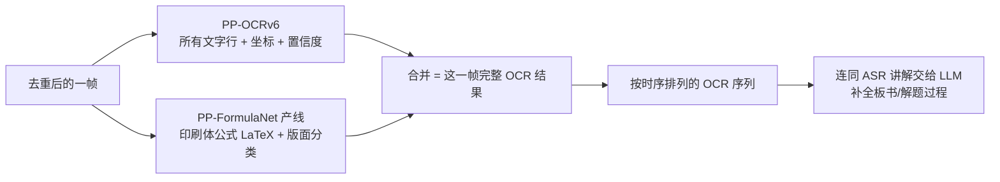

# OCR 方案对比测试报告（R-008 附录）

> **归属**: [R-008_OCR选型横向调研与混合流水线定案](R-008_OCR选型横向调研与混合流水线定案.md) 的支撑测试数据
> **测试日期**: 2026-08-27（PaddleOCR 三代）；2026-08-28（新增 Windows 自带 OCR、PP-FormulaNet 公式专家实测）
> **测试环境**: Windows + RTX 3080 10GB
> **测试图片**: `tests/` 目录 7 张教学视频截图（2560x1440）
> **预期基准**: `scripts/ocr_test_expected.md`（多模态视觉模型生成）

---

## 环境信息

| 项目 | PP-OCRv4 | PP-OCRv6 | PaddleOCR-VL | Windows 自带 OCR | PP-FormulaNet_plus-M |
|---|---|---|---|---|---|
| PaddleOCR | 2.8.1 | 3.7.0 | 3.7.0 | 不依赖（系统内置） | 3.7.0（公式识别产线） |
| PaddlePaddle | 2.6.1 (CUDA 12.0) | 3.2.2 (CUDA 12.6) | 3.2.2 (CUDA 12.6) | 不依赖 | 3.2.2 (CUDA 12.6) |
| 模型 | PP-OCRv4_server | PP-OCRv6_medium | PaddleOCR-VL-0.9B + PP-DocLayoutV2 | Windows.Media.Ocr（zh-Hans-CN） | PP-DocLayout_plus-L（版面）+ PP-FormulaNet_plus-M（公式） |
| 架构 | DB检测+CRNN识别 | DB检测+CRNN识别 | 版面检测+VLM理解 | 系统文字行识别（封闭API） | 版面检测+公式专家模型 |
| 显存占用 | ~1GB | ~1.5GB | ~9.8GB | 0（CPU 运行） | 待测（权重 746MB，估 <2.5GB） |
| Python 环境 | venv/ | venv_paddle3/ | venv_paddle3/ | 系统 Python + winsdk | venv_paddle3/ |
| 成本/依赖 | 免费 | 免费 | 免费 | 免费、零依赖、需系统中文语言包 | 免费 |

---

## 时间开销对比

| 图片 | PP-OCRv4 (s) | PP-OCRv6 (s) | PaddleOCR-VL (s) | Windows OCR (s) | PP-FormulaNet (s) |
|---|---|---|---|---|---|
| 印刷体01.png | 2.041（预热） | 0.736（预热） | **1914.253**（首次JIT预热） | 0.088 | 1.149 |
| 印刷体2.png | 0.140 | 0.253 | 140.354 | 0.114 | 0.165 |
| 印刷体3数学题目.png | 0.099 | 0.234 | **2.874** | 0.045 | 1.888 |
| 印刷体+手写体.png | 0.261 | 0.287 | **2.126** | 0.087 | 0.099 |
| 印刷体+手写体2.png | 0.161 | 0.296 | **2.693** | 0.080 | 0.095 |
| 印刷体+手写体3.png | 0.168 | 0.280 | 429.556（异常慢） | 0.053 | 1.686 |
| 印刷体+手写体4.png | 0.167 | 0.305 | **5.941** | 0.065 | 0.955 |
| **总计** | 3.037 | 2.390 | 2497.797 | 0.532 | 6.037 |
| **稳态平均*** | 0.166 | 0.276 | **~3.4** | **~0.08** | **~0.9** |

> *稳态平均：排除首次预热和异常值后的平均单帧耗时。PaddleOCR-VL 取图片3/4/5/7的平均值（2.1-5.9s）。

**速度分析**：
- Windows OCR 稳态约 0.08s/帧，四者中最快，且无 GPU 占用、无预热
- PP-OCRv4/v6：传统 OCR 流水线，稳态 0.17-0.28s/帧，极快
- PP-FormulaNet 产线：含公式图片约 1-1.9s/帧（版面检测+公式解码），无公式图片约 0.1s/帧（版面检测即返回），约为 VL 速度的 4-6 倍
- PaddleOCR-VL：首次运行 JIT 预热极慢（32分钟），但预热后稳态约 2-6s/帧
- 图片2（140s）和图片6（429s）耗时异常，可能与 VLM 生成长度或特定图像内容有关，需进一步排查
- 以教学视频处理场景（1秒1帧 + 帧变化去重，预计 300-800 帧/视频）：PaddleOCR-VL 稳态约 17-45 分钟/视频；PP-FormulaNet 产线约 5-25 分钟/视频；Windows OCR 全帧跑完仅需约 1 分钟

---

## 核心能力对比：数学公式识别（第一优先级）

### 图片3：印刷体数学题目

**预期内容**：已知 {a, b/a, 1} = {a², a+b, 0}，则 a²⁰²² + b²⁰²³ = ___

| 模型 | 结果 | 评价 |
|---|---|---|
| PP-OCRv4 | **0 行**，完全未检测到文字 | 完全失败 |
| PP-OCRv6 | **0 行**，完全未检测到文字 | 完全失败 |
| PaddleOCR-VL | `已知 $ \left\{a,\frac{b}{a},1\right\}=\left\{a^{2},a+b,0\right\} $，则 $ a^{2022}+b^{2023}= $ ___.` | **完美**，LaTeX 公式准确 |
| Windows OCR | `己 知 磊 口 + b ， 0 则 02022 + b 2023` | 公式打平成碎片：大括号/分数变"磊"，上标丢失，已→己；**无 LaTeX** |
| PP-FormulaNet | `\left\{a,\frac{b}{a},1\right\}=\left\{a^{2},a+b,0\right\}` + `a^{2022}+b^{2023}=` | **完美**，两个公式区域全部正确 LaTeX，与 VL 同级 |

### 图片7：手写解题过程中的公式

**预期内容**：a²=1, a=±1, ⇒ a=-1

| 模型 | 结果 | 评价 |
|---|---|---|
| PP-OCRv4 | "=ezoz9 +zoz"、"（一" | 完全乱码 |
| PP-OCRv6 | "{@,o,①}={a²,a,o}"、"a^2}=1," | 部分识别，大量乱码 |
| PaddleOCR-VL | `$$ a^{2}=1,\quad a=\pm1\quad\Rightarrow\quad a=-1 $$` | **正确**，display_formula 类型 |
| Windows OCR | `纨 = 土 I`（±1 的碎片）等 | 完全乱码，解题过程不可恢复 |
| PP-FormulaNet | `a^{2022}+b^{2023}=(-1)^{2022}+b^{2023}=1\rightarrow0=1` | **部分正确**：识别出 (-1)^{2022}、=1、→0=1 结构链，但 0^{2023} 误为 b^{2023}，a²=1/±1 段漏出；可用 LLM 语义修正 |

### 图片4：手写集合表达式

**预期内容**：1∈{1,2,3}、-1∉{1,2,3}

| 模型 | 结果 | 评价 |
|---|---|---|
| PP-OCRv4 | "2，3"、"}，2，3"，∈/∉ 丢失 | 差 |
| PP-OCRv6 | "1∈{1,2,3}"（0.97）、"-1 $ {1,2,3}" | 大幅提升，∉误识为$ |
| PaddleOCR-VL | `$ 1 \in \{1, 2, 3\} $ -1 ∉ {1, 2, 3}` | **正确**，LaTeX 格式 |
| Windows OCR | 完全丢失，手写公式区域只剩"0" | 完全失败 |
| PP-FormulaNet | 版面检出 0 个公式区域（手写短表达式被标为 image/text） | **漏检**：版面检测未把短小手写集合表达式判为公式 |

**结论**：**印刷体公式 PP-FormulaNet_plus-M 与 VL 同级完美，速度快 2-6 倍**；手写解题过程可给出结构化近似（LLM 可修正）；**手写短小集合表达式是版面检测盲区**，需 VL 或多模态 LLM 兜底。

---

## 印刷体文字识别对比

| 图片 | PP-OCRv4 | PP-OCRv6 | PaddleOCR-VL | Windows OCR | PP-FormulaNet |
|---|---|---|---|---|---|
| 印刷体01.png | 3行全对 0.996+ | 3行全对 0.998+ | 正确（合并为1块） | 明显错字："本"→"朩"、"中"→"巾"，丢"P.S."和"概念…多" | 不适用（仅版面分类 paragraph_title，无文字识别） |
| 印刷体2.png | 全对 0.997 | 全对 1.000 | 正确 | 全对（黑底白字大标题） | 同上 |
| 混合图印刷部分 | 全对 | 全对 | 全对 | 基本正确但丢字："数学成绩好的同学"→"数 学 成 的 同 学"，"所有大于200的实数"→"所 - 句 实 数" | 同上 |

**结论**：纯印刷体大标题 Windows OCR 可正确识别；但正常字号正文有错字和丢词，质量明显低于 PaddleOCR 三代。PP-FormulaNet 产线不做文字识别（只分类版面+识别公式），需与文字 OCR 配合使用。

---

## 手写体文字识别对比

| 内容 | PP-OCRv4 | PP-OCRv6 | PaddleOCR-VL | Windows OCR | PP-FormulaNet |
|---|---|---|---|---|---|
| "元素完全相同" | "元**系**完全相同" | "元**条**完全相同" | **"元素完全相同" 正确** | "尢 尻 飠 囝"（彻底乱码） | 不适用 |
| "b必为0" | "b必为0"（0.77） | "b必为0，"（0.94） | **"b必为0" 正确** | 丢失 | 不适用 |
| "成绩大于130分的同学" | "成**後达**于13分的同学" | "成绩大于130分的同学"（0.97） | "成**德**大于130分的同学" | 丢失（手写标注整块未识别） | 不适用 |
| "你班同学" | **正确（0.999）** | **正确（1.000）** | 丢失 | "尔班同学" | 不适用 |
| 手写数字 "120, 149" | 丢失 | "0.149"（误识） | `$^{120}$ $^{149}$` 正确 | 丢失 | 不适用 |
| "1∈{1,2,3}" | 丢失 | 正确（0.97） | **正确（LaTeX）** | 丢失 | 漏检（版面未判为公式） |
| "300 ✓ 199 ✗" | "300"，✓✗丢失 | "300√"、"199×" | "$300 \times 199$"（✓✗误识为×） | 全部丢失 | 不适用 |

**结论**：PaddleOCR-VL 整体手写识别最好；Windows OCR 对教学板书手写体几乎不可用（乱码或整块丢失），手写标注数字（120/149/300/199）全部丢失。手写符号（✓✗）各家都不理想。

---

## 逐题判定矩阵（以 ocr_test_expected.md 为基准，2026-08-28）

判定标准：该图预期内容**全部**正确识别（印刷体逐字 + 手写语义/结构）才计 ✅；有错字、漏识、乱码、结构错误即为 ❌。

| 测试图 | 预期核心内容 | PP-OCRv4 | PP-OCRv6 | PaddleOCR-VL | Windows OCR | PP-FormulaNet | 入选者 |
|---|---|---|---|---|---|---|---|
| 图1 印刷体01 | P.S./本节课是高中第一节/概念超多的课 | ✅ | ✅ | ✅ | ❌（本→朩、中→巾、丢词） | ➖ | v4、v6、VL |
| 图2 印刷体2 | 集合三大特性 | ✅ | ✅ | ✅ | ✅ | ➖ | 全部 |
| 图3 印刷体公式 | 集合等式+2022/2023 幂（LaTeX） | ❌（0行） | ❌（0行） | ✅ | ❌（打平碎片） | ✅（完美） | VL、FormulaNet |
| 图4 手写公式+标注 | 印刷4项+1∈/∉{1,2,3} | ❌（∈∉碎片） | ❌（∉裂行错位） | ❌（漏"你班同学""元素"） | ❌ | ❌（漏检） | **无** |
| 图5 手写标注 | 印刷4行+120,149/成绩130分/300✓/199✗ | ❌（成後达于13分） | ❌（120→0.149、✓✗误为√×） | ❌（绩→德、✓✗→×） | ❌（丢标注） | ➖ | **无** |
| 图6 手写分析 | 公式+元素完全相同+圆圈标注 | ❌（元系、公式碎片） | ❌（元条、公式@①乱） | ❌（公式多一层圆括号） | ❌ | ❌（\frac{1}{a}幻觉+漏手写） | **无** |
| 图7 完整解题 | 公式+b必为0+集合代入+a²=1⇒a=-1+最终等式 | ❌ | ❌ | ⚠️（仅最终"1+0=1"截断，其余全对） | ❌ | ❌（0^2023误为b、推导漏） | VL（带保留） |

**正确率统计（7 题）**：v4 = 2/7，v6 = 2/7，VL = 3.5/7（图7 差最终等式），Windows = 1/7，FormulaNet = 1/7。

### 判定结论

1. **图4/图5/图6 三题全军覆没**——没有任何方案能独立正确识别"印刷+手写混合标注"场景。这正是混合流水线 + LLM 语义修正 + 云端兜底必须存在的直接证据。
2. **无方案全对 7 题**，单模型路线（包括 VL）不成立。
3. 各方案按"内容项"取长补短才是可行解（见最终结论章节的两引擎并行方案）。

---

## 综合评价

| 维度 | PP-OCRv4 | PP-OCRv6 | PaddleOCR-VL | Windows OCR | PP-FormulaNet |
|---|---|---|---|---|---|
| 数学公式 LaTeX（印刷体） | ❌ 完全失败 | ❌ 完全失败 | ✅ **完美** | ❌ 打平成碎片 | ✅ **完美** |
| 手写解题公式 | ❌ 乱码 | ⚠️ 部分 | ✅ 正确 | ❌ 全部丢失 | ⚠️ 结构化近似（LLM可修正） |
| 手写短小集合表达式 | ❌ | ⚠️ | ✅ 正确 | ❌ | ❌ 漏检 |
| 印刷体文字 | ✅ 优秀 | ✅ 优秀 | ✅ 优秀 | ⚠️ 大标题对，正文有错字/丢词 | ➖ 不做文字识别 |
| 手写体文字 | ⚠️ 差 | ⚠️ 中等 | ✅ 较好 | ❌ 几乎不可用 | ➖ 不做文字识别 |
| 版面分析 | ❌ 无 | ❌ 无 | ✅ 有 | ❌ 无 | ✅ 有（formula/text/title/image/header） |
| 稳态速度 | ✅ 0.17s | ✅ 0.28s | ⚠️ 2-6s | ✅ **0.08s（最快）** | ✅ 0.9s（无公式帧 0.1s） |
| 显存占用 | ✅ ~1GB | ✅ ~1.5GB | ⚠️ ~9.8GB | ✅ **0（CPU）** | ✅ 待测（估 <2.5GB） |
| 首次预热 | 2s | 0.7s | ❌ 32分钟（JIT） | ✅ **无** | ✅ 秒级 |
| 置信度分数 | ✅ 有 | ✅ 有 | ✅ 有 | ❌ 无 | ✅ 有（版面框置信度） |
| 部署依赖 | GPU+CUDA | GPU+CUDA | GPU+CUDA | ✅ 零依赖（需系统语言包） | GPU+CUDA（与 v6 同环境） |

### 最终结论（R-008 定案）

**OCR 只是"线索提供者"，LLM 才是最终识别器。定案：两引擎并行 + LLM 补全**：

分工依据（全部实测验证）：
1. **PP-OCRv6**：所有文字行（印刷体 0.99+ 置信度直接用，手写识不准的交给 LLM 补全）
2. **PP-FormulaNet_plus-M 产线**：印刷体公式 → LaTeX（第一优先级需求达成，图3 完美）；附带版面分类（P2 智能裁剪可复用）
3. **LLM**：从 ASR 讲解 + OCR 碎片 + 上下文补全板书/解题过程/手写公式
4. **置信度天然分工**：v6 高置信度 = 印刷体（直接用）；v6 低置信度/碎片 = 手写板书（LLM 补全）；FormulaNet 识出 = 印刷体公式 LaTeX（直接用）

### 淘汰方案

| 方案 | 淘汰原因 |
|---|---|
| Windows 自带 OCR | 7 题只对 1 题；公式碎片、手写不可用、印刷体正文错字 |
| PaddleOCR-VL | 9.8GB 显存 + 32 分钟预热 + 2-6s/帧；正确率 3.5/7 非碾压，代价不值 |
| 豆包 Vision 云端兜底 | MVP 先不进；遇到具体识不出的帧再加 |
| 颜色过滤（去彩色留黑色） | PPT 可能用彩色字体分章节，去色误删内容；降级 P2 可选配置 |
| PP-OCRv4 | 无独有正确项，被 v6 完全取代 |

### 帧去重说明

**帧去重不用 OCR**——由专门的图像哈希算法（dHash/pHash/SSIM/帧差法，R-009 调研）在 OCR 之前完成。OCR 是昂贵后端，不能当快筛。流程：1 秒抽帧 → 图像哈希比对相邻帧 → 无变化保留前一帧 → 有变化才交给 OCR。

### 待办与后续验证

- [ ] PP-FormulaNet 推理显存实测（nvidia-smi 监控）
- [ ] 帧去重算法选型（R-009：dHash/pHash/SSIM/帧差法对比）
- [ ] 完整视频端到端验证（1s 取帧 + 图像哈希去重 + 两引擎并行 OCR + LLM 补全）
- [ ] 颜色过滤作为 P2 可选配置的开关设计
