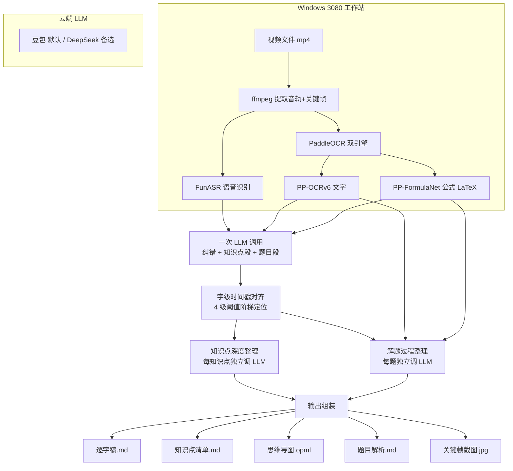

# 教学视频内容提取与总结工具

从教学视频中自动提取**逐字稿、知识点、题目解析、思维导图**，帮助中学生和家长高效复习。

知识点补充范围严格不超出高考，定位为公益开源工具。

## 功能特性

- **纯 ASR 逐字稿**：FunASR 语音识别 + LLM 纠错（同音词、专业术语、标点），字级时间戳对齐
- **知识点深度整理**：核心内容（公式 LaTeX 嵌入讲解）+ 豆包补充（老师未提及但高考相关）
- **题目解析**：ASR + OCR 融合提取原题和解题步骤，每步骤标注时间戳
- **关键帧截图**：1 秒间隔取帧 + dHash 去重（阈值 0.02），按知识点/题目/解题步骤自动截图
- **思维导图**：OPML 格式，可导入 XMind 等工具
- **OCR 双引擎并行**：PP-OCRv6 识文字 + PP-FormulaNet 识公式（LaTeX 输出）
- **适配层架构**：ASR/OCR/LLM 均通过适配层隔离，便于更换引擎

## 架构



## 12 阶段 Pipeline

| # | 阶段 | 说明 |
|---|------|------|
| 1 | probe | 视频探测（时长、分辨率、fps） |
| 2 | extract_audio | ffmpeg 提取音轨 |
| 3 | extract_frames | 1 秒间隔取帧 + dHash 去重 |
| 4 | asr | FunASR 语音识别（字级时间戳） |
| 5 | ocr | PP-OCRv6 + PP-FormulaNet 并行识别 |
| 6 | correct_and_extract | **一次 LLM 调用**：纠错全文 + 知识点段 + 题目段 |
| 7 | summarize_solution | 每题独立调 LLM 整理解题过程（ASR+OCR 融合） |
| 8 | summarize_knowledge | 每知识点独立调 LLM 深度整理 |
| 9 | merge_text | 合并文本 |
| 10 | capture_screenshots | 按知识点/题目/步骤捕获截图 |
| 11 | generate_mindmap | 生成 OPML 思维导图 |
| 12 | assemble_output | 组装最终产物 |

## 快速开始

### 环境要求

- Windows 11 + NVIDIA GPU（RTX 3080 或以上，显存 ≥ 8GB）
- Python 3.10/3.11
- CUDA 12.6 + cuDNN 9
- ffmpeg（加入 PATH）

### 安装

```bash
# 1. 克隆
git clone https://github.com/toddhuang/videocontents.git
cd videocontents

# 2. 创建虚拟环境
python -m venv .venv
.venv\Scripts\activate

# 3. 安装 PyTorch（GPU 版）
pip install torch==2.13.0+cu126 torchaudio==2.11.0+cu126 --index-url https://download.pytorch.org/whl/cu126

# 4. 安装 PaddlePaddle（GPU 版）
pip install paddlepaddle-gpu==3.2.2 -f https://www.paddlepaddle.org.cn/whl/windows/mkl/avx/stable.html

# 5. 安装其他依赖
pip install -r requirements.txt

# 6. 统一 cuDNN（torch 与 paddle DLL 版本对齐，必做）
python scripts/setup_cudnn.py
```

### 配置

复制模板配置文件并填入 LLM API Key：

```bash
copy config.example.yaml config.yaml
# 编辑 config.yaml，填入豆包或 DeepSeek 的 api_key
```

### 运行

```bash
python main.py <视频文件路径> [--output ./output] [--config config.yaml] [--force]
```

参数说明：

| 参数 | 说明 |
|------|------|
| `video` | 输入视频文件路径（必填） |
| `--output, -o` | 输出根目录（默认 `./output`） |
| `--config, -c` | 配置文件路径（默认 `config.yaml`） |
| `--force, -f` | 强制重新处理（忽略缓存） |

### 输出产物

```
output/<视频名>/
├── 01_逐字稿.md           # 纠错后完整逐字稿
├── 02_知识点清单.md       # 知识点深度整理（核心内容 + 补充内容）
├── 03_思维导图.opml       # OPML 格式，可导入 XMind
├── 习题/
│   ├── 题目01.md          # 原题 + 分步骤解析（含 LaTeX 公式）
│   └── ...
└── 截图/
    ├── 知识点01_t=05m23s.jpg
    ├── 题目01_t=12m45s.jpg
    └── 题目01_步骤01_t=13m10s.jpg
```

Debug 产物（默认启用，可在配置中关闭）：

```
debug/<视频名>/
├── 01_ASR原始逐字稿/
├── 02_纠错后全文/
├── 03_知识点文字段/
├── 04_题目文字段/
├── 05_定位记录/
├── 06_知识点截图/
├── 07_题目原题截图/
├── 08_解题过程截图/
└── 09_运行日志/pipeline.log
```

## 技术栈

| 组件 | 技术 | 用途 |
|------|------|------|
| ASR | FunASR 1.4.2 | 语音识别（字级时间戳） |
| OCR 文字 | PP-OCRv6 | 印刷体/手写体文字识别 |
| OCR 公式 | PP-FormulaNet | 数学公式 → LaTeX |
| LLM | 豆包（默认）/ DeepSeek（备选） | 纠错、知识点整理、题目解析 |
| LLM 调度 | LiteLLM | 统一多模型 API 调用 |
| 帧去重 | dHash（阈值 0.02） | 1 秒取帧 + 变化检测去重 |
| 视频处理 | ffmpeg | 音轨提取、帧截取 |
| Python | 3.10/3.11 | 主语言 |

## 项目结构

```
.
├── main.py                # CLI 入口
├── core/                  # 核心业务逻辑（12 阶段 pipeline）
│   ├── pipeline.py        # 流水线编排
│   ├── content_extractor.py   # 阶段 6：纠错+知识点+题目（一次调用）
│   ├── knowledge_extractor.py # 阶段 8：知识点深度整理
│   ├── problem_extractor.py   # 阶段 7：解题过程整理
│   ├── frame_extractor.py     # 关键帧提取（1s+dHash）
│   ├── frame_dedup.py         # 帧去重
│   ├── screenshot_capture.py  # 截图捕获
│   └── ...
├── adapters/              # 适配层（隔离第三方库）
│   ├── asr/               # ASR 适配（FunASR）
│   ├── ocr/               # OCR 适配（PaddleOCR）
│   └── llm/               # LLM 适配（LiteLLM）
├── utils/                 # 工具集
│   ├── llm_json.py        # LLM JSON 解析容错（LaTeX 反斜杠）
│   ├── models.py          # 数据模型
│   └── ...
├── debugger/              # Debug 模块（release 可删）
├── config.yaml            # 本地配置（gitignore）
├── config.example.yaml    # 配置模板
├── tests/                 # 单元测试（pytest）
├── scripts/               # 临时验证脚本
└── Document/              # 开发文档
    ├── 开发文档/           # 需求、架构、接口、详细设计
    ├── 环境文档/           # 部署文档
    └── 调研报告/           # 技术选型调研
```

## 测试

```bash
pytest tests/ --cov
```

覆盖 L1（utils/debugger/adapters mock）+ L2（core 业务模块）共 180+ 用例。

## 文档

详细设计文档见 `Document/` 目录：

- [需求分析](Document/开发文档/01_需求分析.md)
- [架构设计](Document/开发文档/02_架构设计.md)
- [模块接口设计](Document/开发文档/03_接口设计/)
- [模块详细设计](Document/开发文档/04_详细设计/)
- [技术选型调研报告](Document/调研报告/)
- [开发环境安装文档](Document/环境文档/开发环境安装文档.md)

## License

[MIT](LICENSE)
